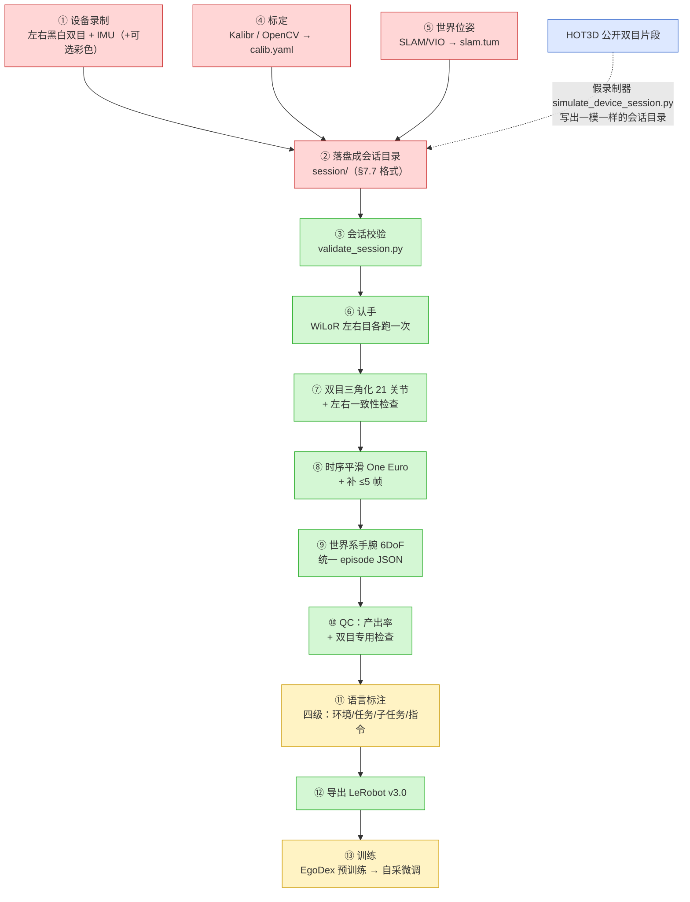
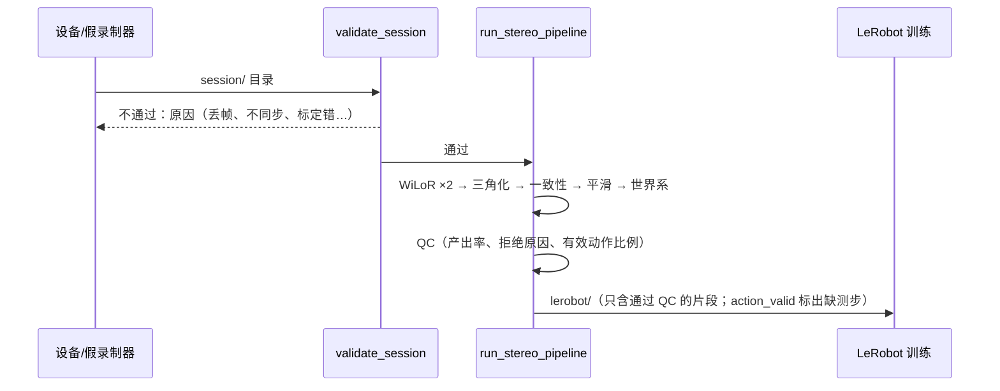

# 整体架构：从戴上设备录制，到训练出模型

目标：**硬件一到，当天就能开始采数据。** 所以除了“必须有真设备才能做”的几步，其他每一步现在都已经用公开数据（EgoDex、HOT3D）跑通过。本文按数据流动的顺序，把每一步讲清楚：输入是什么、输出是什么、文件长什么样、现在验证到了什么程度。

> 新手提示：可以把整条流水线想成“工厂流水线”。头戴设备是“原料采集”，后面每一步都是一道“加工工序”，最后出来的是机器人能直接拿去学习的“成品数据”。

## 1. 一张图看全局



颜色：绿色 = 已用公开数据端到端验证；黄色 = 部分完成；红色 = 必须等硬件；蓝色 = 用来替代硬件的模拟数据源。

## 2. 每一步的状态

| # | 步骤 | 输入 | 输出 / 文件格式 | 代码 | 状态 |
|---|---|---|---|---|---|
| ① | 设备录制 | 相机、IMU | 左右视频、时间戳、IMU 流 | 设备端录制程序（**还没写**，等板子） | 🔴 等硬件。落盘格式已固定（下一行），录制程序只要照着写 |
| ② | 会话目录 | ① 的原始流 | `session/`：`metadata.json`、`timestamps.csv`、`stereo/left.mp4`、`stereo/right.mp4`、`stereo/timestamps_lr.csv`、`calib.yaml`、`slam.tum`、`imu.csv`（规格 `docs/headcam_data_spec.md` §7.7） | `scripts/simulate_device_session.py`（假录制器） | 🟢 格式用 HOT3D 生成的会话端到端验证过 |
| ③ | 会话校验 | 会话目录 | 通过 / 不通过 + 原因（可写 JSON） | `scripts/validate_session.py` | 🟢 正常会话通过；4 种注入故障（丢帧、左右不同步 5 ms、基线单位写成毫米、缺标定）都能抓到 |
| ④ | 标定 | 棋盘格 / AprilGrid 录像 | `calib.yaml`（Kalibr camchain、简单 YAML 或 OpenCV FileStorage 都能读） | 求解在仓库外（Kalibr / OpenCV），仓库只读结果：`headcam/hand_pose.py::load_calibration` | 🔴 求解要真设备；读取已有单元测试 |
| ⑤ | 世界位姿 | 双目 + IMU | `slam.tum`（`timestamp tx ty tz qx qy qz qw`，左目相机在世界里的位姿） | 求解在仓库外（如 ORB-SLAM3 / OpenVINS / Basalt）；仓库只读 TUM | 🔴 要真设备；HOT3D 用的是它自带的位姿 |
| ⑥ | 认手 | 左右视频 | 每帧每目每只手：21 个 2D 点、单目 3D、置信度（缓存 `cache/*.wilor.json`） | `headcam/hand_pose.py`（WiLoR / HaMeR / MediaPipe） | 🟢 EgoDex（单目）、HOT3D（双目）都跑过 |
| ⑦ | 三角化 + 一致性 | ⑥ + `calib.yaml` | 左相机系 21 点（米）；每只手每帧的检查状态 | `headcam/stereo_pipeline.py` | 🟢 HOT3D 4 段跑通，误差见 `docs/stereo_pipeline.md` |
| ⑧ | 平滑 / 补帧 | ⑦ | 平滑后的关节；补的帧标 `filled` | `headcam/hand_track_refine.py` | 🟢 同上；固定手型默认关（EgoDex 上没收益） |
| ⑨ | 世界系 episode | ⑧ + `slam.tum` | 统一 episode JSON（世界系 21 点、手腕 xyz+四元数、置信度、`stereo` 诊断字段） | `headcam/stereo_pipeline.py`、`egodata/schema.py` | 🟢 |
| ⑩ | QC | episode | `qc/yield.csv`、`qc/yield.html`；坏帧原因 7 类（手出画、视线飘移、运动模糊、静止、只有一目认到、左右对不上、补出来的帧）。另报有效动作比例，以及 16/50/100 步窗口里两只手每一步都有效的比例（片段比窗口短时为空，不写成 0）。统计含被拒绝的片段 | `egodata/qc.py`、`egodata/stereo_qc.py`、`egodata/action_valid.py` | 🟢；阈值是事先定的，等自采数据再校准 |
| ⑪ | 语言标注 | episode + 视频 | episode 里 `annotation`（四级） | `egodata/labels.py`、`validate_hierarchy.py` | 🟡 结构和校验有；自采数据的标注流程（人工 / VLM）还没定 |
| ⑫ | LeRobot 导出 | 通过 QC 的 episode | LeRobot v3.0 目录（parquet + mp4 + meta）。每行多一列 `action_valid`，形状 `(2,)`（左、右）。当前帧和下一帧该手手腕都是实测才为 1：有限、不是 `filled`、逐帧状态为空 / `none` / `ok`、数字置信度不低于 0.5。存了 `good_frame_mask` 时，false 的帧两只手都为 0。缺测仍写下「保持不动」的占位。`meta/egodata_export.json` 写通过片段上的有效动作比例和 16/50/100 整段窗口比例 | `egodata/lerobot_export.py`、`egodata/action_valid.py`、`ego_to_lerobot.py` | 🟢 EgoDex 与 HOT3D 的导出路径都在；全量上的有效动作比例 **待补** |
| ⑬ | 训练 | LeRobot 数据集 | 策略权重。损失只加在 `action_valid=1` 的手上。线性模型见 `ego_pretrain_bc.py`（`--min-valid-fraction`，默认 0，不够的窗口不抽）。ACT 见 `ego_act_train.py` 和 `notebooks/egodex_act_scaling_colab.ipynb`：两只手都无效并进 `action_is_pad`，单手无效按维屏蔽；`EGO_MIN_VALID_FRACTION` 把不够的窗口清成填充（仍会被抽到，损失为 0）。没有该列的旧导出全部当成有效，并打印警告 | `ego_pretrain_bc.py`、`ego_act_scaling.py`、`ego_act_train.py` | 🟡 EgoDex 上线性预训练跑过；ACT 掩码要本机装有 LeRobot 才生效；自采微调要等数据 |

缺测、补帧、立体或逐帧标注丢掉的手腕，导出时仍写成「保持不动」，但 `action_valid` 为 0，损失不加在这一手上。质检报告按全部片段（含被拒绝的）汇总；导出摘要只统计质检通过、已经丢掉最后一帧的那些行。窗口长度 16 / 50 / 100 里，片段短于窗口时比例是空，不写成 0。合成两条各 30 帧的 EgoDex 样本上，质检（含被拒绝的一条）有效动作比例 0.500000、16 步整段 0.500000、50 和 100 为 n/a；导出只留通过的一条时，有效动作比例 1.0、16 步窗口 1.0、50 和 100 为 null。命令和逐条数字在 [`docs/PROGRESS.md`](PROGRESS.md) 的风险清单。全量 EgoDex 的比例 **待补**。

## 3. 一条命令

自有设备和 HOT3D 走同一个入口：

```bash
# 设备到货后：先校验，再跑管线
python scripts/validate_session.py /data/sess01
python scripts/run_stereo_pipeline.py --session /data/sess01 --out outputs/sess01

# 现在：用 HOT3D 模拟
python scripts/run_stereo_pipeline.py --hot3d data/train_quest3/clip-000000 --out outputs/hot3d
```



## 4. 真正需要硬件才能做的事（剩余缺口）

1. **设备端录制程序**：在 RK3566 上同时录左右双目、IMU，按 §7.7 落盘，并写 `stereo/timestamps_lr.csv`。格式和校验已就绪，程序本身要在板子上写和调。
2. **标定求解**：双目内外参、IMU–相机外参与时间偏移（Kalibr）。仓库只读结果。
3. **SLAM / VIO**：从自采双目 + IMU 算 `slam.tum`。HOT3D 用的是它自带的位姿，没有验证过我们自己的 SLAM 精度。
4. **真实同步误差**：HOT3D 左右曝光时间完全一致（0 ms），我们设备的硬件同步要实测。
5. **自采画面上的认手效果**：OV9281 黑白、镜头畸变、头带晃动、光照，都和 Quest3 不同。
6. **QC 阈值校准**：现在的阈值是事先按常识定的（见 `docs/stereo_pipeline.md`），要用第一批自采数据再定。
7. **真实 IMU**：HOT3D 没有 IMU。假录制器的 `--synth-imu` 是从位姿反推出来的，只能测格式和时间对齐，不能测噪声。
8. **手快速运动**：HOT3D 里手动得较慢，快速动作下的误差还没测。

第一天上手的具体步骤见 [`docs/hardware_day1_checklist.md`](hardware_day1_checklist.md)。
