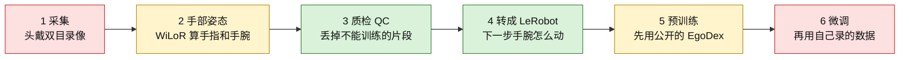

# 项目进度（给第一次看仓库的人）

> 更新日期：2026-10-10。这是一份活文档：做到哪一步、下一步干什么，都写在这里。
> 名词先说人话：**采集** = 头上戴着摄像机录自己的手；**手部姿态** = 从画面里算出手指和手腕在哪儿；**QC** = 质检，扔掉手出画、糊掉或干等太久的片段；**LeRobot** = 训练代码能直接读的数据格式；**预训练** = 先用别人公开的第一视角视频学；**微调** = 再用自己录的数据改模型。

仓库在做两件事：一条能训练的模仿学习流水线，和一副还没做出来的头戴双目采集设备。软件大多已经能跑。缺的是设备，以及设备到手之后用自己的数据再训一次。

---

## 1. 一张图看懂项目

数据从左流到右。颜色表示现在的状态：绿 = 这条软件路径已经能跑；黄 = 只做了一部分；红 = 还在等。

| 步骤 | 状态 | 现在意味着什么 |
|---|---|---|
| 1 采集 | 未开始 | 会话目录和转换脚本写好了。双目设备还没到手，所以没有自己的录像。 |
| 2 手部姿态 | 部分完成 | 代码能换 WiLoR、HaMeR 或 MediaPipe，也能做双目三角化。公开的 HOT3D 双目上，手腕中位数 1.22 cm（见第 4.5 节）。自己设备上的误差还没测。双目一条命令管线已在 HOT3D 4 段上端到端跑通（第 4.6 节）。 |
| 3 质检 QC | 已完成 | 手出画、视线飘、转头太快、停太久，都会被标出来。公开数据和将来的头戴数据用同一套规则。 |
| 4 转成 LeRobot | 已完成 | 只导出质检通过的片段。动作是「下一小段手腕移动了多少」。 |
| 5 预训练 | 部分完成 | 简单的线性模型在 EgoDex 测试集上跑过，并且看到损失会停住。图像 ACT 的笔记本在，**还没在完整测试集上训完**。 |
| 6 微调 | 未开始 | 等自己的录像。微调用多少步、真实任务成功率，都还没有数字。 |

你现在在哪：

---

## 2. 当前状态和下一步

**一句话：软件大体就绪，正在等双目设备；设备做好之后，用自己采的数据训练。**

已经能做的：

- 在公开的 EgoDex 上：下载说明、转成统一格式、质检、覆盖统计、导出 LeRobot、跑线性模型、画缩放曲线。
- 在还没有的头戴会话上：同一套脚本可以读双目视频、标定文件和可选的相机轨迹，写出同一份 JSON。
- 在仿真基准上：pusht 的 ACT、Square 的 BC-RNN，用来确认训练框架能跑。它们**不能**直接当成头戴人手的成绩。

还不能做的：

- 没有设备，就没有自己的双目录像，也没有「自采数据上的手腕误差」和「自采微调是否更好」。这些格子写 **待补**。
- EgoDex 上的图像 ACT 还没训完，验证损失 **待补**。

建议的下一步，按这个顺序：

1. 按 [`docs/headcam_stereo_bom.md`](headcam_stereo_bom.md) 把 1000 元内的双目头戴买齐、装好。下单前向卖家要 **8–10 cm** 基线，镜头选约 **100°**，不要 75°。
2. 在设备外做标定，并把相机轨迹写成 TUM 文件。仓库只读这些结果，不在这里算标定，也不跑 SLAM。
3. 按 [`docs/hardware_day1_checklist.md`](hardware_day1_checklist.md) 录第一段，先 `scripts/validate_session.py` 校验，再跑 `scripts/run_stereo_pipeline.py --session ...`，看手腕误差离 2 cm 还有多远。这个数现在是 **待补**。整体架构和每一步的状态见 [`docs/PIPELINE_ARCHITECTURE.md`](PIPELINE_ARCHITECTURE.md)。
4. 设备还在做的时候，可以在 Colab 上把 EgoDex 的 ACT 四档训完（笔记本已写好）。训完后把验证损失填进本文第 4 节。
5. 自采片段通过质检之后，再谈微调。步数、学习率和真实成功率都还没有，不要把预训练配方里的 `steps: 2000` 当成微调步数。

---

## 3. 时间线

更早的底子不在下面的 PR 里：2026-08-02 放进了训练日志、头戴规格 v8、单目采购表和两段式方案初稿。下面按时间列出 PR #1–#22。已合并条目的时间是合并时间（UTC）的日期；#22 用开出当天的日期。#2 比 #3 晚几分钟合并，所以表按时间排，不按号码排。

| 日期 | PR | 一句话 |
|---|---|---|
| 2026-10-09 | [#1](https://github.com/skyxiaobai/robot/pull/1) | 分析脚本换一台电脑克隆后不再崩溃，损失里的 KL 项也不再算大 10 倍。 |
| 2026-10-09 | [#3](https://github.com/skyxiaobai/robot/pull/3) | 规格升到 v9：要记世界坐标系里的手和手腕，并加上「数据量变大时验证损失怎么变」的拟合。 |
| 2026-10-09 | [#2](https://github.com/skyxiaobai/robot/pull/2) | 加了一本 Colab 笔记本，按仓库里的超参重跑 pusht 上的 ACT（10 万步）并做无头评估。 |
| 2026-10-09 | [#4](https://github.com/skyxiaobai/robot/pull/4) | 还没有自己的设备，先把 EgoDex 收成统一格式，并做出质检产出率和覆盖报告。规格到 v10。 |
| 2026-10-09 | [#5](https://github.com/skyxiaobai/robot/pull/5) | 质检通过的片段可以导出成 LeRobot v3.0，并在 CPU 上跑一个线性模型记下验证损失。 |
| 2026-10-09 | [#6](https://github.com/skyxiaobai/robot/pull/6) | 修全量 EgoDex 上会把曲线带偏的问题：缺置信度不再当成 0，手腕朝向不再每帧翻面，验证集按整段留出。动作改成手腕的移动量。 |
| 2026-10-09 | [#7](https://github.com/skyxiaobai/robot/pull/7) | 小数据量也能抽满样本，很小的损失不再被写成 0.0000，覆盖统计不再把全部 JSON 留在内存里。 |
| 2026-10-09 | [#8](https://github.com/skyxiaobai/robot/pull/8) | 每一档数据量共用同一套均值和标准差，缩放图可以和「手保持不动」比。 |
| 2026-10-09 | [#9](https://github.com/skyxiaobai/robot/pull/9) | 损失不再下降时，报告改画会饱和的幂律，并加上 EgoDex 图像 ACT 的多档训练笔记本。 |
| 2026-10-09 | [#10](https://github.com/skyxiaobai/robot/pull/10) | 能把骨架、质检对照和头/手腕的三维轨迹画出来；符号链接的任务文件夹不再被整组跳过。 |
| 2026-10-09 | [#11](https://github.com/skyxiaobai/robot/pull/11) | 头戴会话可以估计手、用左右目校正尺度，并写成和 EgoDex 相同的 JSON。 |
| 2026-10-09 | [#12](https://github.com/skyxiaobai/robot/pull/12) | Colab 上 pusht 评估不再因为异步环境找不到 `gym_pusht` 而中断，失败后改同步再试。 |
| 2026-10-10 | [#13](https://github.com/skyxiaobai/robot/pull/13) | 新版 MediaPipe 去掉旧接口后仍能认手，并补上和 EgoDex 真值比误差的办法。 |
| 2026-10-10 | [#14](https://github.com/skyxiaobai/robot/pull/14) | WiLoR / HaMeR 改用真实焦距和主点，手腕深度不再落到几十米外。 |
| 2026-10-10 | [#15](https://github.com/skyxiaobai/robot/pull/15) | 二维关键点改回虚拟焦距投影，避免手形被拉歪，并找齐 WiLoR 自带的 MANO 均值文件。 |
| 2026-10-10 | [#16](https://github.com/skyxiaobai/robot/pull/16) | 没装 torch 或检测器时，手部后端算作不可用，测试跳过而不是导入失败。 |
| 2026-10-10 | [#17](https://github.com/skyxiaobai/robot/pull/17) | 文档改成：双目是核心设备，预训练用 EgoDex。当时写明双目采购清单还没更新（本次进度已补上清单）。 |
| 2026-10-10 | [#18](https://github.com/skyxiaobai/robot/pull/18) | 加上会持续更新的进度页，以及 1000 元以内的双目采购清单；只记已经做完的事，没测过的结果留空。 |
| 2026-10-10 | [#19](https://github.com/skyxiaobai/robot/pull/19) | 头戴手部轨迹可以选做时序精修：平滑关节和手腕、补上短缺口，并按每一段的骨长缩放。 |
| 2026-10-10 | [#20](https://github.com/skyxiaobai/robot/pull/20) | 记下 WiLoR 手部精修消融；评估脚本可以用 WiLoR 检测，并和 MediaPipe 分开缓存。 |
| 2026-10-10 | [#21](https://github.com/skyxiaobai/robot/pull/21) | 记下 HOT3D Quest3 双目手腕评测（中位 1.22 cm，单目 2.71 cm），采购改为向卖家要 8–10 cm 基线和约 100° 镜头。 |
| 2026-10-10 | [#22](https://github.com/skyxiaobai/robot/pull/22) | 一条命令跑通双目手部管线，并加上 HOT3D 适配器、假录制器、会话校验，以及整体架构和到货第一天文档。 |
| 2026-10-10 | [#23](https://github.com/skyxiaobai/robot/pull/23) | 刚体对齐手腕、2 cm 速度门限和 RTS 平滑写入管线；立体门限丢掉的帧改记标注覆盖，不再用 20% 坏帧把整段拒绝掉。 |
| 2026-10-10 | [#24](https://github.com/skyxiaobai/robot/pull/24) | 双目手部关联：翻转 TTA（左右两种假设）+ 时序/双目关联 + 去重 + 另一目重裁，HOT3D 标注覆盖 53% → 71%，手腕误差不变。 |

---

## 4. 实验数据

只写仓库文件或 PR 正文里出现过的数，以及下面单独标明的「Grok Bot 评测记录」。没写进来的，就是还没有，标 **待补**。合成样本上的冒烟损失（用来确认命令能跑完）不放进这张表。

### 4.1 手部姿态：WiLoR 和 MediaPipe

主后端选 WiLoR。MediaPipe 是没有 GPU / 没有 MANO 权重时的 CPU 兜底。下面前几行是本次记入进度的评测，来源写在表里。

| 指标 | WiLoR | MediaPipe | 来源 |
|---|---|---|---|
| 在 EgoDex 上的检出率 | 约 95% | 约 50% | Grok Bot 评测记录。README 核心结论写了同样的约数 |
| 关节误差 | 约 3.5 cm | 约 8 cm | Grok Bot 评测记录。README 核心结论写了同样的约数 |
| 单目手腕位置，中位数，还没按尺度对齐 | 约 10.1 cm | 待补 | Grok Bot 评测记录 |
| 单目手腕位置，按片段尺度对齐之后 | 约 4.0 cm | 待补 | Grok Bot 评测记录 |
| 想达到的手腕位置误差 | 2 cm 以内 | 同左 | Grok Bot 评测记录；README 也写了这个目标 |
| 三条简单片段上的手腕误差均值 | 6.2 cm | 39.4 cm | Grok Bot 评测记录。片段是 `fold_unfold_paper_basic`、`measure_objects`、`assemble_disassemble_soft_legos`。这是简单片段，**不是** EgoDex 整体 |

PR 正文里还有一次更细的单目手腕数，和上面的约数接近，但是另一次记录，不要当成同一个四舍五入：

| 记录 | 未对齐 | 按尺度对齐后 | 说明 |
|---|---|---|---|
| PR #14 | 10.1 cm | 3.95 cm | 只把焦距换成 EgoDex 的真实 fx（约 736.6）。改之前手腕深度大约 25 m、绝对误差大约 19 m（虚拟焦距约 37500 px） |
| PR #15 | 10.11 cm | 3.96 cm | 同一次复核。该环境没有 WiLoR 权重，没有重跑。修二维投影之前，21 点中位误差从 36 px 升到 55 px；修好之后的二维误差 **待补** |

自己这台双目设备上的手腕误差：**待补**。公开 HOT3D 上的双目数在第 4.5 节，不是这台还没买的设备。单元测试里的合成点三角化误差小于 0.1 mm、融合后在 1 mm 内（PR #11），那是已知三维点，不是人手。

### 4.2 双目采购和理论上的深度误差

1000 元内的清单在 [`docs/headcam_stereo_bom.md`](headcam_stereo_bom.md) 和 [`docs/headcam_stereo_bom.csv`](headcam_stereo_bom.csv)。价格查询日期 2026-10-10。旧的 [`docs/headcam_bom.csv`](headcam_bom.csv) 仍是单目表，没有删。

| 方案 | 合计 | 要不要买 |
|---|---|---|
| A（推荐） | 约 727–982 元 | 双目模组 DECXIN OV9281，298 元，标为已核实。其余多项是估算区间 |
| B | 约 837–1077 元 | 只有按区间低价买，才可能压在 1000 元内（约 837 元起） |

0.5 m 处的理论深度误差（75° 视场、焦距 834 px、基线 6 cm），来自双目清单里的几何表：

| 视差误差 | 深度误差 |
|---|---|
| 0.25 px | 1.2 mm |
| 0.5 px | 2.5 mm |
| 1 px | 5.0 mm |

所以在这个假设下，大约是 **1–5 mm**，几何上比 2 cm 的目标细。清单里写明：实际误差主要来自关键点抖、标定和时间同步，不是这行公式单独能保证的。HOT3D 上的选型见第 4.5 节：基线至少 6 cm，下单向卖家要 8–10 cm；镜头选约 100°，不要 75°。

### 4.3 pusht 上的 ACT，以及 Square 上的 BC-RNN

这些是仿真基准，用来确认训练代码能跑。来源主要是 `outputs/report_20260801/training_report.html`（报告日期 2026-08-01）和 README。10 月的 Colab 笔记本用来复现，并修了评估崩溃；修完之后有没有新的成功率，仓库里没有新数字，记为 **待补**。

| 实验 | 结果 | 来源 |
|---|---|---|
| ACT · pusht | 206 集，10 fps。输入图像 96×96 加 2 维状态，输出 2 维动作，一次预测 100 步。损失 6.19（200 步）→ 0.261（1 万步）→ 0.118（5 万步）→ 0.094（8 万步）→ **0.074（10 万步）** | 训练报告 |
| ACT · pusht 评估 | 20 次，成功率 **0–5%**，最好 5%。平均最高回报 0.41，其中最高 0.56 | 训练报告 |
| ACT 官方复现 | 训到 20 万步，损失 0.081；10 万步时 0.108。评估视频仍是失败 | 训练报告（部分日志当时在 `/tmp`，数字写进了已提交的 HTML） |
| MimicGen Square 生成 | 成功 1000 / 尝试 2091，成功率 47.8%（`outputs/twostage_evidence.txt` 里的 `success_rate` 为 47.824%） | 规格 §1.2、`outputs/mimicgen_gen.log` 的汇总 |
| BC-RNN · Square | 图像输入最高 **68%**（第 240 轮）；低维状态最高 **76%**（第 300 轮）。报告里「最近一次」分别是 56% 和 64% | 训练报告；日志文件名里的 `success_0.68` / `success_0.76` |

损失下降没有带来推 T 成功。这是任务本身的结果，不是 10 月笔记本坏了。

### 4.4 EgoDex 上的缩放

EgoDex 测试集核对结果（`docs/gap_analysis.md`，2026-10-09）：约 16.1 GB（`content-length` = 17,304,529,397 字节），3243 条、111 个任务。PR #7 写的是 3,243 条 / 826,253 帧。454 条 HDF5 没有置信度组。真实全量的质检产出率百分比：**待补**（工具在，仓库里没有一份最终产出率）。

线性模型（只用手部状态，不是图像）在第四次全量重跑后稳定（`docs/gap_analysis.md`）：

| 现象 | 数字 |
|---|---|
| 「手保持不动」基线 | 1.088572 |
| 损失何时不再沿对数直线降 | 大约 6.4 万个样本之后 |
| 全量相对「保持不动」好多少 | 大约 6% |
| 仓库外的 MLP | 25.6 万之后也停住 |
| 图像 ACT 的验证损失 | **待补**。笔记本计划四档：64 / 256 / 1024 / 全部（约 1800）条，步数 300 / 800 / 1500 / 2000。预计训练约 80 分钟，连下载和导出约 2.5–3.5 小时。这是预计耗时，不是已跑完的成绩 |

第三次重跑里，基线曾从 2.77 变到 1.09，是因为每一档用了不同的标准化。这是已修掉的问题，不要拿来和 1.088572 比谁更好。

`examples/scaling_law_runs.yaml` 是合成例子，真值 `L = 2 - 0.25·ln(小时)`，拟合结果 R² = 1.0000、n = 4（PR #3）。它只检查拟合代码，**不是** EgoDex 的损失。

数据量参考（规格附录，不是本仓库在头戴数据上的实测）：有预训练底座时每任务约 50–150 条用于微调；从零约 500–1000 条。EgoScale 公开口径是约 21,000 小时预训练、约 50 小时动捕、约 4 小时遥操作。本仓库没有这批小时数。

### 手部时序精修消融：WiLoR（EgoDex 4 条测试片段，1053 帧）

详细说明见 `docs/hand_refine_egodex.md`。

用 `python scripts/eval_hand_refine.py --backend wilor --out <报告>` 跑出（需设好 WILOR_CHECKPOINT / WILOR_DETECTOR / WILOR_CONFIG / MANO_MODEL_DIR，并把 WiLoR 仓库放进 PYTHONPATH）。WiLoR 官方权重，CPU，**全部 1053 帧逐帧检测，没有抽帧**，约 17 分钟。精修参数与上面完全相同。手腕深度来自 WiLoR 自己的相机平移估计，单目，不是双目米制。

排除关节 0 和 1：

| 方法 | 检出率 | MPJPE 均值 (cm) | MPJPE 中位 (cm) | 手腕无尺度 中位/均值 (cm) | 手腕对齐后 中位/均值 (cm) | 抖动 (m/s²) | 左右交换率 | 高置信检出率 |
| --- | --- | --- | --- | --- | --- | --- | --- | --- |
| 基线 | 97.7% | 3.99 | 3.74 | 22.28 / 22.79 | 4.76 / 5.13 | 20.799 | 0.0% | 93.9% |
| 只平滑 | 96.6% | 3.89 | 3.59 | 22.48 / 22.68 | 4.64 / 4.98 | 6.041 | 0.0% | 92.8% |
| 只补洞 | 98.5% | 3.98 | 3.75 | 22.23 / 22.81 | 4.76 / 5.11 | 19.919 | 0.0% | 93.9% |
| 只固定手型 | 97.7% | 3.99 | 3.74 | 22.28 / 22.79 | 4.76 / 5.13 | 20.801 | 0.0% | 93.9% |
| 全部打开 | 97.4% | 3.88 | 3.60 | 22.48 / 22.71 | 4.65 / 4.97 | 4.264 | 0.0% | 92.8% |

基线匹配 1681 / 可见 1720。全部打开匹配 1676 / 可见 1720。

要点（都和 WiLoR 基线比）：

- 只平滑：抖动 20.799 → 6.041 m/s²，MPJPE 均值 3.99 → 3.89 cm，对齐后手腕中位 4.76 → 4.64 cm；检出率 97.7% → 96.6%（滤波滞后让少数帧手腕超出 250 px 门限）。
- 只补洞：检出率 97.7% → 98.5%，其他基本不变；WiLoR 本来漏检少、左右交换率已是 0.0%，可补的洞不多。
- 只固定手型：MPJPE 3.99 → 3.99 cm，几乎没变化。WiLoR 输出来自 MANO，每帧骨长本来就接近一致，固定中位骨长没有额外收益（MediaPipe 上是 9.51 → 9.34）。
- 全部打开：抖动 20.799 → 4.264 m/s²，MPJPE 3.99 → 3.88 cm，对齐后手腕中位 4.76 → 4.65 cm，检出率 97.7% → 97.4%。
- 无尺度手腕误差仍在 22 cm 左右，精修改不了单目深度，这一项要靠双目。

### 4.5 HOT3D 双目手腕

完整表和仿真在 [`docs/hot3d_stereo/results.md`](hot3d_stereo/results.md)。Quest3 真实图像上，WiLoR 左右目三角化，和同一批手上的单目比：

| 指标 | 双目 | 单目 |
|---|---|---|
| 手腕位置，中位数 | **1.22 cm** | 2.71 cm |
| 手腕在 2 cm 以内 | **75%** | — |
| 全部关节（MPJPE），中位数 | **2.12 cm** | 4.09 cm |

硬件建议（依据同一份结果，仿真数字不在这里重复）：

- 两目硬件同步，偏差 **≤ 1 ms**。
- 基线 **≥ 6 cm**，最好 **8–10 cm**。下单向卖家要 8–10 cm。
- 视场角约 **100°**。75° 会让大约三分之一的手不同时出现在两只镜头里。
- **640×400** 就够。再高的分辨率几乎不改善手腕误差。
- 全局快门和 60 fps 是加分项，不是门槛。

这是公开头显上的数。自己的头戴录像还没有，自采手腕误差仍是 **待补**。

### 4.6 双目一条命令管线（HOT3D Quest3，4 段 × 150 帧）

说明与完整表在 [`docs/stereo_pipeline.md`](stereo_pipeline.md)，原始报告在 `docs/stereo_pipeline/`。WiLoR 左右目 → 21 点三角化 → 左右一致性检查 → One Euro → 世界系 → QC → LeRobot。手腕世界坐标误差（中位 / p90 / ≤2 cm）：

| 组 | 结果 |
|---|---|
| 检查前（两目都认到，989 只手·帧） | 1.27 / 4.83 cm / 71% |
| 同一批手的单目 | 2.59 / 6.19 cm / 35% |
| 检查后（941） | 1.24 / 3.97 cm / 73% |
| 最终，平滑后测到的帧（908） | 1.30 / 3.76 cm / 74% |

- 一致性检查拒掉约 5% 的手，p90 4.83 → 3.97 cm；最差 10% 仍约 4 cm，没有降到 2 cm。
- PR #19 的 One Euro 参数（1.0 / 0.5）在世界系上滞后，留出 3 段上手腕中位 1.29 → 2.07 cm；管线改用 3.0 / 50（只在 clip-000000 上选），留出段 1.30 cm，基本中性，抖动下降。
- 产出率 25%（150 / 600 帧，1 段通过）。最大原因是“只有一目认到手”（113 帧）。关掉一致性检查时 50%。这是 PR #22 当时的 QC：立体门限丢掉的帧也算坏帧。新默认下这些帧改记成标注覆盖，不再用这 20% 拒绝整段；四段在新 QC 下的片段产出率 **待补**（没有重跑 HOT3D）。见下面「双目尾部误差」。
- 耗时：首次 1994.9 秒（CPU 8 核无 GPU），其中 WiLoR 1634.5 秒、HOT3D 转换 356.0 秒，其余不到 4 秒。
- 假录制器 + `validate_session.py`：正常会话通过，丢帧、左右差 5 ms、基线按毫米写、缺标定 4 种注入故障都被抓到。

---

## 5. 决策记录

| 日期 | 决定 | 依据 |
|---|---|---|
| 2026-10-09 | **iPhone 采集管线暂停。** 当前不把手机当采集设备。 | 规格 v8 删掉了「Ego 头显 / iPhone」外部产品规格，以及「未来 Pipeline 接入检查」。这段正文随 2026-08-02 的文档进入仓库，规格页眉日期是 2026-10-09。仓库里没有另一份标题就叫「暂停公告」的文件。10 月 9 日之后的 PR 都在做头戴和 EgoDex，没有再接 iPhone 录制。 |
| 2026-10-09 | **还没有设备，预训练用 EgoDex。** | `docs/gap_analysis.md`：位姿是录制时的世界系，测试包可以公开下载。HOT3D 要另下 MANO；夹爪遥操作数据没有人手 21 点。 |
| 2026-10-10 | **手部后端用 WiLoR。** MediaPipe 只做 CPU 兜底。 | README 核心结论；Colab 笔记本默认优先 WiLoR。HaMeR 仍可换，但要额外编译检测器，不作为默认。 |
| 2026-10-10 | **双目是核心，不是可选项。** 两个摄像头算手离相机多远；IMU 和 SLAM/VIO 一起算相机在世界里的位置，不只抵消头的晃动。 | PR #17 和规格 2026-10-10 对 §0 / §3 的修订。旧单目表里「双目 ≥1500–3000 元、可选」那一行保留作对照，不再代表现行方案。 |
| 2026-10-10 | **1000 元内的双目清单单独成文。** 不把旧单目表的价格改写成新报价。 | 本次加入 `docs/headcam_stereo_bom.md` 与 `.csv`。推荐方案 A 约 727–982 元。 |
| 2026-10-10 | **下单向卖家要 8–10 cm 基线，镜头选约 100°。** 硬件同步 ≤ 1 ms。640×400 够用；全局快门和 60 fps 是加分项。 | HOT3D Quest3 实测：双目手腕中位数 1.22 cm，75% 在 2 cm 内；全部关节 2.12 cm。详见 `docs/hot3d_stereo/results.md`。 |

| 2026-10-10 | **硬件一到就采集：除必须有设备的步骤外，全部先用 HOT3D 验证。** 双目管线 One Euro 用 3.0 / 50，不用 PR #19 的 1.0 / 0.5。 | `docs/stereo_pipeline.md` §3.2；`docs/PIPELINE_ARCHITECTURE.md` §4 列出剩余只能靠硬件的缺口。 |

Square / pusht 只验证训练框架。本体、视角和动作都跟头戴人手不一样，权重不能直接搬过去。这条写在 `docs/twostage_pretrain_finetune_plan.md`。

---

## 6. 待办清单

- [x] 分析脚本在干净克隆上能跑（PR #1）
- [x] pusht ACT 训到 10 万步，并有 Colab 复现入口（成绩见第 4.3 节；修评估之后的新成功率待补）
- [x] 头戴规格写到 v10：世界系的手、四级语言、质检、覆盖
- [x] EgoDex → 统一格式 → QC → 覆盖 → LeRobot v3.0
- [x] 线性模型在 EgoDex 测试集上的缩放测完，并确认会饱和
- [x] 骨架 / 质检 / 轨迹可视化
- [x] 头戴会话转换、双目三角化、WiLoR 用真实焦距（代码）
- [x] 1000 元内双目采购清单
- [x] 双目一条命令管线（WiLoR ×2 → 三角化 → 一致性 → 平滑 → 世界系 → QC → LeRobot），HOT3D 上跑通
- [x] 会话校验脚本和假录制器（HOT3D → 设备格式，含故障注入）
- [x] 整体架构文档和到货第一天检查清单
- [ ] 设备端录制程序（按 §7.7 落盘，并写 `stereo/timestamps_lr.csv`）
- [ ] 用第一批自采数据重新定 QC 阈值。手出画、视线飘移、运动模糊、摆拍或静止仍用 EgoDex 的 20% 坏帧。双目丢掉的标注另报覆盖率，`--min-label-coverage` 默认 0（只报告、不拒绝），这个数是临时的，等自采数据再定。
- [ ] 买齐并装好双目头戴（方案 A）。下单前向卖家要 8–10 cm 基线，镜头选约 100°
- [ ] 标定（内参、双目外参、IMU 到相机），结果写成仓库能读的 yaml
- [ ] 在设备上跑 SLAM / VIO，把相机轨迹写成 TUM。没有轨迹时坐标还在相机系，不能当成世界系
- [ ] 用自己的录像跑通 `convert_headcam.py`，记下手腕误差（目标 2 cm，现在待补）
- [ ] 在 Colab GPU 上训完 EgoDex ACT 四档，把验证损失填回第 4.4 节
- [ ] 给数据补上按时间切开的子任务，以及左右手分别的指令。不要在转换脚本里编造
- [ ] 质检增加「看图像是否模糊」。现在用的是相机转得多快，不是像素
- [ ] 自采数据通过质检后做微调，并写下真实任务怎么算成功（步数和成功率都待补）

---

## 7. 如何更新本文档

改代码或合并 PR 之后，顺手改这一页，避免它变成过期的计划。

1. 把文首的「更新日期」改成当天。
2. 在第 3 节表格加一行：日期、PR 链接、一句大白话（这件事让新手能多做什么，或修了什么错）。
3. 有新测量时，加到第 4 节，并写来源（文件路径或 PR 号）。仓库和 PR 里没有的数，写 **待补**，不要估一个看起来合理的值。
4. 第 1 节的图和第 6 节的勾选要一起改：做完把 `- [ ]` 改成 `- [x]`，图里的颜色从红/黄改到绿。
5. 设备状态变了（比如相机到了、第一次自采训完），改第 2 节的那句「一句话」和下一步顺序。
6. 采购价格变了，改 `docs/headcam_stereo_bom.md` 和 `.csv`，再改第 4.2 节里的合计，不要只改一边。
7. README 导航已经链到本文。如果又有一份「建议从这里读起」的文档，在 README 的文档表里加一行，不要让两份进度各写各的。

## 双目尾部误差（HOT3D）

稳健刚体对齐取手腕 + 2 cm 速度门限 + RTS 平滑：p90 3.93 → 2.34 cm（中位 1.11，≤2cm 85%，产出 81%）；留出段 p90 2.1–3.5 cm。2 cm p90 需要再扔帧（产出约 60%）。详见 [hot3d_stereo/tail.md](hot3d_stereo/tail.md)。

立体门限丢掉的帧（跳点、左右对不上、只有一目、补帧）不再计入片段坏帧，改报标注覆盖率。片段只因手出画、视线飘移、运动模糊、静止超过 20% 而失败。`--min-label-coverage` 默认 0，只报告、不因此拒绝；这个下限是临时的，等真实设备数据再定。新 QC 下 HOT3D 四段的片段产出率没有重跑，记为 **待补**。

## 双目手部关联（HOT3D）

WiLoR 每个手框按左右两种假设各跑一次（翻转 TTA），再用双目重投影、手形、帧间位移和“一只手不能既左又右”选出左右手，必要时在另一目重新裁剪。标注覆盖 53.2% → 70.7%，手腕中位 1.11 cm 不变，p90 2.34 → 2.29 cm，≤2cm 85% → 87%，可信手帧 783 → 881；MPJPE 略差约 0.5 mm；手部模型耗时约 2.6 倍。clip-001100 仍只有 44%（手常常只在一个画面里）。详见 [hot3d_stereo/hand_assoc.md](hot3d_stereo/hand_assoc.md)。
