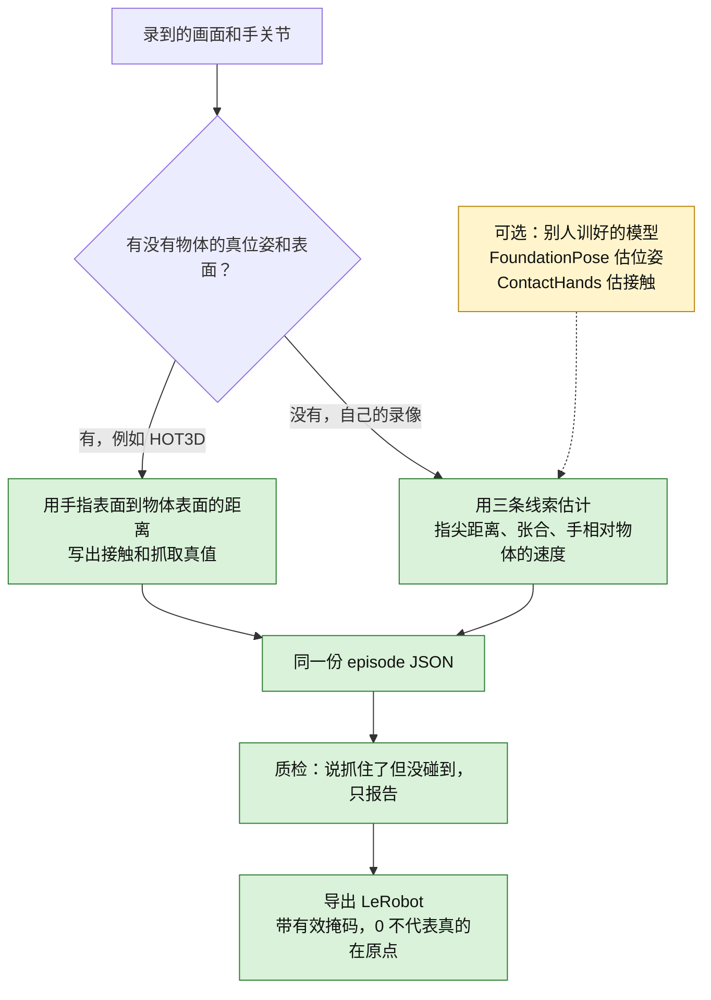
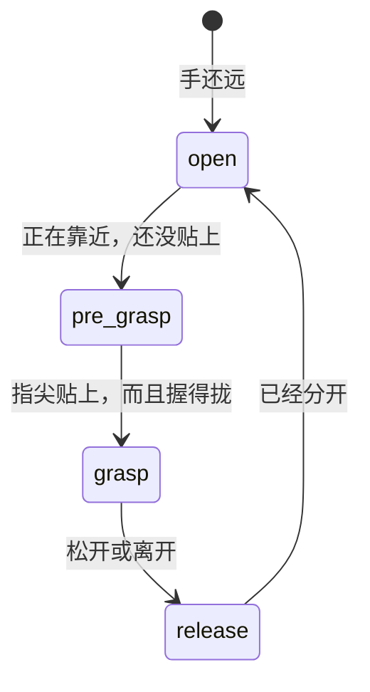

# 物体在哪、手有没有抓住（给第一次看的人）

更新日期：2026-10-10。规格正文在 [`headcam_data_spec.md`](headcam_data_spec.md) §9（v11）。这里只讲人话。

机器人要学「拿起杯子」，得知道三件事：杯子在世界里的位置和朝向、手哪一帧碰到了杯子、这一下是伸手、握住还是放开。以前的统一格式里只有手。现在这三件事也写进去了。

## 一张图



黄色表示：钩子留了位置，本仓库不下载、也不运行那些模型。

四个状态可以想成手去拿杯子的过程：



## 字段长什么样

一条 episode 里新加四块。`schema_version` 还是 `1.0`。

- `objects`：每个物体一条轨迹。`id`、类别、世界系 7 个数（位置 + 四元数）、置信度、这一帧有没有效、位姿从哪来。
- `contact`：左手、右手每一帧碰到了哪个 `id`。没碰到是空。不知道则 `valid` 为 false。
- `grasp`：每一帧是 `open` / `pre_grasp` / `grasp` / `release`。
- `events`：变了的时刻，例如「0.5 秒右手开始碰到杯子」。

名字列表还在 `coverage.objects` 里，那是用来统计「采过哪些物体」的。顶层 `objects` 才是位置。

没有这些数据时（比如 EgoDex）写空轨迹，有效位全是 false。不要把缺测写成 0：0 会被误认成「物体在原点」或「手是张开的」。

## 真值和估计差在哪

**HOT3D** 自带物体位姿（文件名 `物体.json` 那种 `<帧号>.objects.json`）和手。适配器在 `scripts/headcam/hot3d_adapter.py`。有物体表面和手部点时，距离小于 5 mm 算接触；至少两根指尖也这么近，才算抓住。5 mm 还没有拿真实 HOT3D 片段调过。

**自己的录像**没有这套真值。启发式（`scripts/egodata/interaction.py`）看：

1. 五根指尖离物体表面有多近（默认 1 cm，比真值松，因为关节不在皮肤上）。
2. 拇指尖和食指尖张得多开（默认拢到 8 cm 以内，并且至少两根指尖贴着，才算抓住）。
3. 手是在靠近物体还是在离开。靠近但还没碰到，记成预备；上一帧抓住、这一帧不满足了，记成放开。

默认再加一道时间滤波，避免关节抖一下就多记一次接触或抓取：

- 贴上用更近的距离（默认就是上面的 1 cm）。松开要更远，默认再加 1 cm（也就是 2 cm）。落在两档中间时，保持原来的状态。
- 新状态要连续保持 0.1 秒才写出去。看的是时间戳，不是帧数，所以换帧率不会改成「连续 N 帧」。
- 关掉：调用时加 `temporal_filter=False`，或 `scripts/eval_hot3d_contact.py --no-temporal-filter`。

表面可以是网格、一个球，或者「指尖深度和物体深度差不多」。

如果以后接上 FoundationPose（估物体位姿）或 100DOH / ContactHands（估接触），把函数传给 `pose_hook` / `contact_hook` 即可。不传就只用上面的启发式。

## 导出和质检

LeRobot 里多了这些列，每一列都有掩码，写法和原来的 `observation.hand_valid` 一样：

| 列 | 干什么 |
|---|---|
| `observation.object_pose` | 最多 4 个物体的 7 个数，按名字排序 |
| `observation.object_pose_valid` | 这 4 个槽位哪个能用 |
| `observation.contact` | 左右手各：碰到了第几个槽（没碰到是 -1）和置信度 |
| `observation.contact_valid` | 左右手的接触能不能用 |
| `action.grasp` | 左右手当前是张开、预备、抓住还是放开（编码 0/1/2/3） |
| `action.grasp_valid` | 这格抓取能不能用 |

`action.grasp` 是这一帧手处于什么状态，不是「下一帧手腕移动了多少」。事件因为条数不固定，写在 `meta/interaction_events.jsonl`。

质检如果看到「状态是抓住，但接触是空」，会在报告里计数。它**不会**因此把整段扔掉。这个规则还没在自己的录像上定过阈值。

## 已经算出来的数，和还没有的数

下面是一个故意做小的合成例子：半径 3 cm 的球，3 帧，只有右手。皮肤比骨头近 6 mm，所以真值早一帧发现碰到了。命令：

```bash
python scripts/eval_contact_grasp.py --synthetic
```

| 指标 | 这个合成例子 |
|---|---|
| 接触精确率 | 1.0（1 次报对，0 次报错） |
| 接触召回率 | 0.5（真值有 2 帧接触，启发式只报出 1 帧） |
| 抓取精确率 | 1.0 |
| 抓取召回率 | 1.0 |
| 事件时间差，中位数 | 0.05 秒 |

接触开始的事件差了 0.1 秒（晚了 1 帧），抓住的事件两边在同一帧，所以中位数是 0.05 秒。左手没有有效帧，精确率和召回率是空，不是 0。

这张表只是合成例子，而且关了时间滤波（整段只有 0.2 秒，短于默认的 0.1 秒停留）。HOT3D 真实片段的结果见下一节；那些数同样是没开滤波的。

## HOT3D 真实片段上的结果（2026-10-10）

命令：`python scripts/eval_hot3d_contact.py --clips-dir <HOT3D train_quest3> --models <object_models_eval> --mano <MANO> --stereo-episodes <双目 episodes> --tune clip-000000 --out out/ --no-temporal-filter`。完整数字在 [`contact_eval/hot3d_report.json`](contact_eval/hot3d_report.json)。**这些数字是没开时间滤波跑的。** 滤波默认已经打开；开着滤波再跑一遍是 **待补**。

- 数据：HOT3D-Clips Quest3 的 10 段，每段 150 帧，左右手共 3000 个手帧。物体网格来自 HF `bop-benchmark/hot3d` 的 `object_models_eval`。
- 真值：MANO 手表面 778 个顶点到物体网格的距离。≤5 mm 算接触；按蒙皮权重分出的 5 根手指末节里，至少 2 根 ≤5 mm 算抓取。抽查 clip-000000：接触帧里手到物体的最近距离中位数约 0.2 mm，说明网格和位姿对得上。
- 估计：`estimate_interaction`，**物体位姿和网格用的是 HOT3D 真值**，只有手换成 (a) MANO 真值的 21 个关节，或 (b) 双目管线输出的关节（PR #24 的 4 段，排除无效帧和补帧）。所以这里测的是「手关节 → 接触/抓取」这一步，没有算上物体位姿估计的误差。
- 调参只用 clip-000000（网格搜索 contact_m、min_tips、aperture_grasp_m），下面是其余片段汇总的数字。clip-000700 整段没有接触，不参与统计。

| 手的来源 | 参数 | 接触 P / R / F1 | 抓取 P / R / F1 | 测试片段 |
|---|---|---|---|---|
| 真值关节 | 默认 | 0.99 / 0.97 / 0.98 | 0.99 / 0.82 / 0.90 | 8 段 |
| 真值关节 | 调过（1 cm，1 指，8 cm） | 0.99 / 0.97 / 0.98 | 0.95 / 0.84 / 0.89 | 8 段 |
| 双目估计 | 默认 | 0.95 / 0.79 / 0.86 | 0.98 / 0.51 / 0.67 | 2 段有接触（000300、001100） |
| 双目估计 | 调过（2 cm，1 指，10 cm） | 0.85 / 0.88 / 0.86 | 0.71 / 0.58 / 0.63 | 同上 |

事件时间（只算配上的事件）：真值关节下几乎都在同一帧，中位数 0–0.07 秒。双目下，配上的事件中位数 0.03–0.28 秒，但误报很多：默认参数下 clip-000000 真值 8 个事件，估计报出 54 个。原因是双目关节逐帧抖动，接触状态反复跳。

逐段看：
- 真值关节下，接触基本没问题（7 段 F1 ≥0.98，clip-000776 是 0.89）。抓取在 clip-000564、clip-001100 只有 0.6 左右：真值认为是用手指末节抓，关节点离表面却超过 1 cm。
- 双目下，clip-000300 接触 F1 0.96，clip-001100 只有 0.69（默认）/ 0.74（调过）。

结论：
1. 用这套启发式，从手关节判断「碰没碰到」是可行的。判断「是不是抓住」还偏弱，召回率只有 0.5–0.6。
2. 在 clip-000000 上调过的参数，迁移到其他片段后接触 F1 不变，抓取 F1 反而变差（0.67 → 0.63），所以默认值保持不变。
3. 双目关节逐帧抖，接触会反复跳。时间滤波已经默认打开（进入/离开两档距离，并且至少停留 0.1 秒，跟帧率无关；`--no-temporal-filter` 关掉）。上面的表和 JSON **没有**这道滤波。开了滤波的重跑是 **待补**。
4. 局限：测试片段只有 8 段（双目只有 2 段有接触），物体位姿用的是真值。

顺带修了一处：`_distance_to_triangles` 原来逐个三角形用 Python 循环，HOT3D 网格最多 2 万个面，一段要跑几分钟。现在改成 numpy 向量化，结果和原实现在 1e-15 以内一致。
