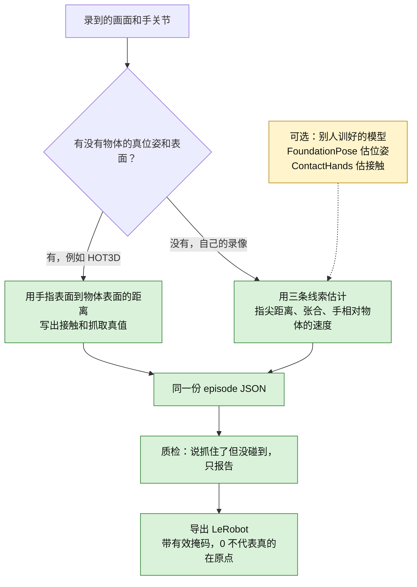
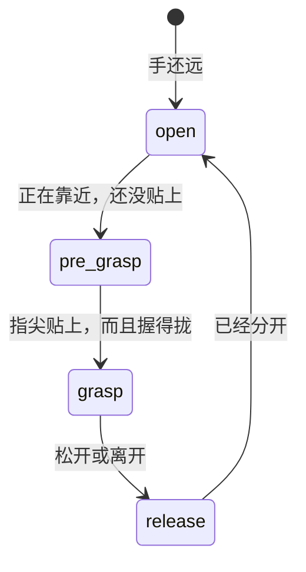

# 物体在哪、手有没有抓住（给第一次看的人）

更新日期：2026-10-10。规格正文在 [`headcam_data_spec.md`](headcam_data_spec.md) §9（v11）。这里只讲人话。

机器人要学「拿起杯子」，得知道三件事：杯子在世界里的位置和朝向、手哪一帧碰到了杯子、这一下是伸手、握住还是放开。以前的统一格式里只有手。现在这三件事也写进去了。

## 一张图



黄色表示：钩子留了位置，本仓库不下载、也不运行那些模型。

四个状态可以想成手去拿杯子的过程：



## 字段长什么样

一条 episode 里新加四块。`schema_version` 还是 `1.0`。

- `objects`：每个物体一条轨迹。`id`、类别、世界系 7 个数（位置 + 四元数）、置信度、这一帧有没有效、位姿从哪来。
- `contact`：左手、右手每一帧碰到了哪个 `id`。没碰到是空。不知道则 `valid` 为 false。
- `grasp`：每一帧是 `open` / `pre_grasp` / `grasp` / `release`。
- `events`：变了的时刻，例如「0.5 秒右手开始碰到杯子」。

名字列表还在 `coverage.objects` 里，那是用来统计「采过哪些物体」的。顶层 `objects` 才是位置。

没有这些数据时（比如 EgoDex）写空轨迹，有效位全是 false。不要把缺测写成 0：0 会被误认成「物体在原点」或「手是张开的」。

## 真值和估计差在哪

**HOT3D** 自带物体位姿（文件名 `物体.json` 那种 `<帧号>.objects.json`）和手。适配器在 `scripts/headcam/hot3d_adapter.py`。有物体表面和手部点时，距离小于 5 mm 算接触；至少两根指尖也这么近，才算抓住。5 mm 还没有拿真实 HOT3D 片段调过。

**自己的录像**没有这套真值。启发式（`scripts/egodata/interaction.py`）看：

1. 五根指尖离物体表面有多近（默认 1 cm，比真值松，因为关节不在皮肤上）。
2. 拇指尖和食指尖张得多开（默认拢到 8 cm 以内，并且至少两根指尖贴着，才算抓住）。
3. 手是在靠近物体还是在离开。靠近但还没碰到，记成预备；上一帧抓住、这一帧不满足了，记成放开。

表面可以是网格、一个球，或者「指尖深度和物体深度差不多」。

如果以后接上 FoundationPose（估物体位姿）或 100DOH / ContactHands（估接触），把函数传给 `pose_hook` / `contact_hook` 即可。不传就只用上面的启发式。

## 导出和质检

LeRobot 里多了这些列，每一列都有掩码，写法和原来的 `observation.hand_valid` 一样：

| 列 | 干什么 |
|---|---|
| `observation.object_pose` | 最多 4 个物体的 7 个数，按名字排序 |
| `observation.object_pose_valid` | 这 4 个槽位哪个能用 |
| `observation.contact` | 左右手各：碰到了第几个槽（没碰到是 -1）和置信度 |
| `observation.contact_valid` | 左右手的接触能不能用 |
| `action.grasp` | 左右手当前是张开、预备、抓住还是放开（编码 0/1/2/3） |
| `action.grasp_valid` | 这格抓取能不能用 |

`action.grasp` 是这一帧手处于什么状态，不是「下一帧手腕移动了多少」。事件因为条数不固定，写在 `meta/interaction_events.jsonl`。

质检如果看到「状态是抓住，但接触是空」，会在报告里计数。它**不会**因此把整段扔掉。这个规则还没在自己的录像上定过阈值。

## 已经算出来的数，和还没有的数

下面是一个故意做小的合成例子：半径 3 cm 的球，3 帧，只有右手。皮肤比骨头近 6 mm，所以真值早一帧发现碰到了。命令：

```bash
python scripts/eval_contact_grasp.py --synthetic
```

| 指标 | 这个合成例子 | HOT3D 上的真实片段 |
|---|---|---|
| 接触精确率 | 1.0（1 次报对，0 次报错） | 待补 |
| 接触召回率 | 0.5（真值有 2 帧接触，启发式只报出 1 帧） | 待补 |
| 抓取精确率 | 1.0 | 待补 |
| 抓取召回率 | 1.0 | 待补 |
| 事件时间差，中位数 | 0.05 秒 | 待补 |

接触开始的事件差了 0.1 秒（晚了 1 帧），抓住的事件两边在同一帧，所以中位数是 0.05 秒。左手没有有效帧，精确率和召回率是空，不是 0。

这张表不能当成 HOT3D 或自采数据的成绩。本环境没有 HOT3D 的 clip、物体网格和 MANO，所以那一列是 **待补**。
