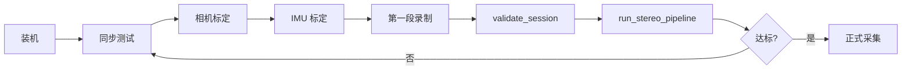

# 硬件到货第一天：检查清单

目标：当天装好、标定好、录第一段、跑通管线，确认数据能用。每一步都写了“怎么做”和“合格线”。合格线尽量来自 HOT3D 实测（`docs/stereo_pipeline.md`、`docs/hot3d_stereo/results.md`），来源写在括号里。



## 0. 装机（30 分钟）

- [ ] 双目和 IMU 固定在**同一块硬板**上，拧紧，之后不再拆（拆了要重新标定）。
- [ ] 向卖家确认基线（目标 8–10 cm）、镜头视场（约 100°）、每目分辨率和帧率、能否锁定曝光、走 USB3 还是 USB2（问题清单见 `docs/headcam_stereo_bom.md`）。
- [ ] 主控能同时录两路 + IMU。快动作用 **60 fps**；30 fps 可以先跑通，但快手会丢掉更多帧（见 `docs/hot3d_stereo/fast_motion.md`）。

插上双目后，对**每个**视频节点做下面三项（模组如果只出一个拼接设备，就查这一个节点，并确认拼接后能拆成两目）：

```bash
# 这个节点支持的分辨率和帧率。期望每目 ≥1280×800 且能到 60 fps；拼接输出则是 2560×800 一类。
v4l2-ctl -d /dev/video0 --list-formats-ext
v4l2-ctl -d /dev/video2 --list-formats-ext   # 有第二个节点再查；没有就跳过

# USB 速度。5000M（或 10000M）是 USB3；480M 是 USB2，原始 1280×800×2 @60 fps 不够。
lsusb -t
```

- [ ] 每个要录的节点都列出了目标分辨率，并且该分辨率下帧率 ≥60（至少有一档 60）。
- [ ] `lsusb -t` 里这颗设备的速度是 5000M 或更高，不是 480M。
- [ ] 左右（或拼接画面的左右半幅）分辨率一致。

关掉自动曝光并锁定在 ≤2 ms（最多 5 ms）。UVC 的 `exposure_absolute` 多数以 100 µs 为单位，所以 2 ms = 20；以 `--all` 里的说明为准，锁完用 `validate_session.py` 看写进文件的秒数，不要只看寄存器的整数。

```bash
v4l2-ctl -d /dev/video0 --all          # 先看 exposure_auto / exposure_absolute 的取值说明
v4l2-ctl -d /dev/video0 -c exposure_auto=1          # 1 = 手动（V4L2_EXPOSURE_MANUAL）
v4l2-ctl -d /dev/video0 -c exposure_absolute=20     # 常见单位 100 µs，20 = 2 ms
v4l2-ctl -d /dev/video0 -C exposure_auto -C exposure_absolute
# 有第二个节点就对 /dev/video2 再做一遍，两目锁成同一个值
```

- [ ] `exposure_auto` 是手动，改场景亮度时画面亮度会变（自动曝光没在偷偷拉长曝光）。
- [ ] 录制程序把锁定值写进 `metadata.json` 的 `exposure_locked=true`、`auto_exposure=false`、`exposure_time_s`（秒），并把每一帧的曝光写进 `stereo/exposure.csv`（`frame_index,left_exposure_s,right_exposure_s`）。
- [ ] `validate_session.py` 里曝光最大值 ≤5 ms；超过 2 ms 会警告，快手不要用。

## 1. 同步测试（左右是否同时曝光）

- [ ] 录制程序给每帧写左右两个时间戳到 `stereo/timestamps_lr.csv`（`frame_index,left_s,right_s`）。
- [ ] 对着一块快速闪烁的 LED 或手机秒表（毫秒显示）录 10 秒，逐帧对比左右画面里的读数。
- [ ] `python scripts/validate_session.py <session>` 里 `sync_ms.max` **≤ 1 ms**（HOT3D 仿真：同步差 1 ms 时 2 cm 内比例 67%，10 ms 时 62%，30 ms 时 50%；见 PR #21）。
- [ ] `dropped_or_jitter_frames` 为 0；`measured_fps` 与设定一致。

## 2. 双目标定（Kalibr 或 OpenCV）

二选一：

**A. Kalibr（推荐，后面 IMU 标定也用它）**
1. 打印 AprilGrid（如 6×6，tag 边长按实际打印尺寸量，单位米），贴在硬平板上。
2. 慢速移动设备，让标定板覆盖画面各处、各种角度，录 60–90 秒（两路同步）。
3. 转 rosbag 后：`kalibr_calibrate_cameras --bag calib.bag --topics /cam0/image_raw /cam1/image_raw --models pinhole-radtan pinhole-radtan --target april_6x6.yaml`
4. 得到 `camchain-*.yaml`，直接改名为会话里的 `calib.yaml`（仓库能读 Kalibr 格式，cam0=左、cam1=右）。100° 镜头畸变大时可试 `pinhole-equi`，但仓库目前只做 radtan（OpenCV 5 参数）去畸变，用 equi 需先离线去畸变视频。

**B. OpenCV 棋盘格**
1. 棋盘格（如 9×6 内角点，量好格子边长），左右同时拍 30–50 组不同姿态。
2. `cv2.stereoCalibrate` 得到 `cameraMatrix1/2`、`distCoeffs1/2`、`R`、`T`，用 `cv2.FileStorage` 写成 yaml（仓库能读）。

合格线：
- [ ] 标定重投影 RMS **≤ 0.5 px**（经验值，非本仓库实测）。
- [ ] 标定出的基线和尺子量的差 **≤ 2 mm**；`validate_session.py` 会检查基线在 4–15 cm（防止毫米/米写错）。
- [ ] 对着已知距离（如 50 cm）的标定板角点三角化，距离误差 ≤ 5 mm。

## 3. IMU–相机标定（Kalibr）

- [ ] 先静置录 2 小时 IMU 求噪声参数（`allan_variance_ros`），或先用数据手册值。
- [ ] 对着 AprilGrid 充分激励各轴转动和平移，录 60 秒：`kalibr_calibrate_imu_camera --bag ... --cam camchain.yaml --imu imu.yaml --target april_6x6.yaml`
- [ ] 记下 IMU–相机外参和时间偏移；时间偏移应 **≤ 几毫秒**并稳定。
- [ ] 跑一个 VIO/SLAM（ORB-SLAM3 双目惯性、OpenVINS、Basalt 任选）输出 TUM 轨迹 `slam.tum`。走一圈回到原点，闭环误差应在厘米级。

## 4. 第一段录制（冒烟测试）

- [ ] 按 `docs/headcam_data_spec.md` §7.7 落盘一段 30–60 秒、双手在桌面操作物体的录像。
- [ ] `python scripts/validate_session.py /data/day1/sess01` → 必须“通过”。
- [ ] `python scripts/run_stereo_pipeline.py --session /data/day1/sess01 --out outputs/day1`
- [ ] 打开 `outputs/day1/report.md` 对照下表。

| 指标（report.md / report.json） | 合格线 | 依据 |
|---|---|---|
| 两目都认到的手占认到的手 | ≥ 85%（HOT3D 上 941+48 / 941+48+134 ≈ 88%，这里 Quest3 视场约 91°） | `docs/stereo_pipeline.md` §3 |
| 通过一致性检查的比例（占两目都认到） | ≥ 90%（HOT3D 95%） | 同上 |
| 一只手的重投影误差中位数（episode 的 `stereo.reproj_px`） | 多数 ≤ 10 px；如果普遍 > 5 px，先怀疑标定或同步 | 检查阈值 |
| 手腕深度 | 0.2–0.8 m 之间为主 | 常识 |
| 手掌（手腕到中指根） | 7–11 cm 为主；系统性偏大/偏小说明基线或尺度错了 | 常识 |
| 产出率 | 先只看趋势；HOT3D 上严格口径 25% | §3.3 |

## 5. 手腕精度代理测试（没有动捕时）

没有动捕真值，用两个代理：
- [ ] **静止尺子**：手腕贴在桌面上已知间距（如 30 cm）的两个标记之间移动，三角化出的距离误差 ≤ 2 cm。
- [ ] **左右手互测**：双手合十静止 5 秒，两只手腕的距离应稳定在几厘米内，标准差 ≤ 1 cm。

## 6. 达标后

- [ ] 把 `calib.yaml` 和设备编号一起存档；每次拆装后重做第 2 步。
- [ ] 按 `docs/PIPELINE_ARCHITECTURE.md` 的流程正式采集；每段录完先跑 `validate_session.py`。
