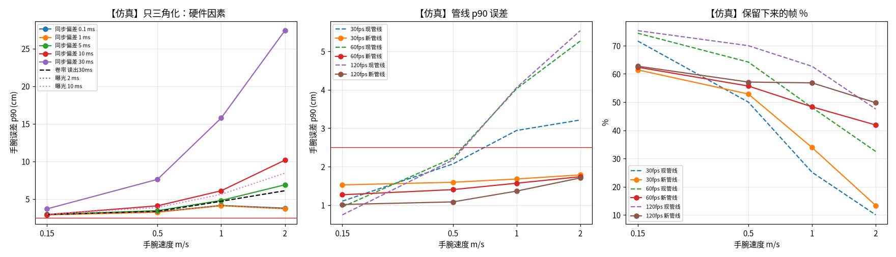

# 手快速移动时，OV9281 双目够不够用？

> 标记：**【实测】** = 真实数据/真实图像上算出来的数；**【仿真】** = 把 HOT3D 真值手轨迹放进虚拟 OV9281 双目、加上【实测】的 WiLoR 误差算出来的预测。没有手填的数字，全部可由 `scripts/eval_fast_motion.py` 等脚本复现，原始结果在 `fast_motion_data/`。



## 一句话结论

**OV9281 硬件同步全局快门双目，对“快手”是够用的；真正不够的是我们管线里的“去抖/去跳点”设置。** 硬件这边只需保证三条：两目硬件同步（偏差 ≤ 1 ms）、曝光 ≤ 2–5 ms、最好 60 fps。管线这边必须把“每帧跳 2 cm 就剔掉”的门限改成按速度/时间算的，并把平滑参数调松，否则手一快就有一半以上的帧被误杀。

## 1. 人手到底有多快？【实测】

| 数据 | 片段数 | 手腕速度 中位数 | p90 | p99 | 最大 | 速度 >1 m/s 的帧 |
|---|---|---|---|---|---|---|
| HOT3D Quest3（相机系，含头动） | 150 段 | 0.14 m/s | 0.47 | 1.01 | 2.1 | 1.1% |
| HOT3D Aria（相机系） | 100 段 | 0.15 m/s | 0.47 | 0.93 | 2.9 | 0.7% |
| EgoDex（世界系，30 fps，1500 段随机抽样） | 1500 段 | 0.01 m/s* | 0.29 | 0.72 | 4.7** | 0.2% |

\* EgoDex 很多帧手是静止的。\*\* 单帧最大值可能来自标注跳变，不代表真实速度。速度的变化率（加速度）在 HOT3D 上 p99 约 4 m/s²。

所以：桌面操作里**绝大多数时间手速 <0.5 m/s；1 m/s 是“快”，2 m/s 是“很快”（甩、抛、快速伸手）**，只占约 1%，但这些往往是动作最关键的时刻。下面按 0.15 / 0.5 / 1 / 2 m/s 四档来测。

## 2. 真实快片段上的双目误差【实测】

从 250 段里挑出手最快的 3 段 Quest3 片段（clip-000776/000684/000564），逐帧（30 fps，450 帧，900 只手）跑 WiLoR 左右目 + 三角化，**不做剔点和平滑**：

| 手腕速度 | 手数 | 误差中位数 | p90 | 2 cm 以内 |
|---|---|---|---|---|
| ≈0.15 m/s | 423 | 1.58 cm | 2.44 cm | 74% |
| ≈0.5 m/s | 80 | 1.30 cm | 2.41 cm | 83% |
| ≈1 m/s | 44 | 1.48 cm | 4.95 cm | 66% |
| ≈2 m/s | 5 | 2.46 cm | — | 40% |

两目都认出手的比例 94%。≈1 m/s 档 p90 变大，但样本只有 44 只手，2 m/s 只有 5 只，**真实快动作的数据太少，不能单靠它下结论**，所以下面用仿真补上。（Quest3 的曝光时间和快门参数数据里没记录。）

## 3. 运动模糊对 WiLoR 的影响【实测】

在 HOT3D 真实图像（焦距约 505 px，和 OV9281 配 100° 镜头的约 537 px 接近）上加不同长度的运动模糊，重跑 WiLoR（103 只手）：

| 模糊长度 | 0 px | 4 px | 8 px | 16 px | 32 px |
|---|---|---|---|---|---|
| 还能认出手 | 100% | 98% | 92% | 83% | **43%** |
| 2D 关键点误差中位数 | 9.7 px | 10.2 | 10.4 | 12.4 | 14.2 |

模糊长度 ≈ 手在画面里的速度 × 曝光时间。手在 40 cm 远、以 1 m/s 横向移动时，OV9281 100° 镜头上约 1340 px/s：

| 曝光 | 1 m/s 时的模糊 | 2 m/s 时的模糊 |
|---|---|---|
| 1 ms | 1.3 px | 2.7 px |
| 2 ms | 2.7 px | 5.4 px |
| 5 ms | 6.7 px | 13 px |
| 10 ms | 13 px | 27 px（认手率可能掉到一半） |

（这张表是按几何公式算的，不是实测。）**结论：曝光要锁在 ≤2 ms，最多 5 ms，不能让相机自动曝光拉到 10 ms 以上。** 室内光线不够时，OV9281 对近红外很敏感，可以加一个 850 nm 补光灯。

## 4. 各硬件因素的影响【仿真】

虚拟 OV9281：1280×800、100°、基线 9 cm。把 HOT3D 9 段片段的真值轨迹在时间上压缩 1/3/6/10 倍得到快动作，按瞬时速度分档。这里**只三角化、不剔点不平滑**，看的是硬件本身的影响。数字是手腕误差 **p90（cm）**，越小越好：

| 配置 | 0.15 m/s | 0.5 m/s | 1 m/s | 2 m/s |
|---|---|---|---|---|
| 基准：全局快门、硬件同步、曝光 2 ms | 2.9 | 3.3 | 4.1 | 3.7 |
| 同步偏差 0.1 ms | 2.9 | 3.3 | 4.1 | 3.8 |
| 同步偏差 1 ms | 2.9 | 3.2 | 4.1 | 3.7 |
| 同步偏差 5 ms | 2.9 | 3.4 | 4.8 | 6.9 |
| 同步偏差 10 ms | 2.9 | 4.1 | 6.1 | 10.2 |
| 同步偏差 30 ms（软件同步的典型值） | 3.7 | 7.6 | 15.8 | 27.4 |
| 卷帘快门 读出 10 ms | 2.9 | 3.2 | 4.2 | 4.1 |
| 卷帘快门 读出 30 ms | 2.9 | 3.4 | 4.7 | 6.1 |
| 曝光 5 ms | 3.0 | 3.3 | 4.5 | 4.8 |
| 曝光 10 ms | 3.0 | 3.9 | 5.6 | 8.4 |
| 反例：两颗独立卷帘 USB 摄像头，软同步 15 ms，曝光 10 ms | 3.2 | 5.3 | 9.9 | 17.3 |

说明：单帧仿真用的是“每帧独立抽样”的 WiLoR 误差，单帧 p90 会比真实情况偏大；这里主要看**随速度怎么变**。

- **同步偏差**：≤1 ms 完全没影响；5 ms 在 2 m/s 时开始明显变差；30 ms 不能用。→ **必须硬件同步**。
- **卷帘快门**：两目同时卷帘时，深度影响不大（左右同一行同时曝光），读出 30 ms 在 2 m/s 时变差。OV9281 是全局快门，没有这个问题。
- **曝光**：10 ms 在 2 m/s 时 p90 翻倍，还没算认手率下降（见第 3 节）。

## 5. 帧率和管线：真正的瓶颈【仿真】

同一台虚拟 OV9281，这次跑完整的“剔跳点 + 平滑”：

| 配置 | 1 m/s p90 | 1 m/s 保留帧 | 2 m/s p90 | 2 m/s 保留帧 |
|---|---|---|---|---|
| 30 fps 现管线（每帧跳超 2 cm 就剔 + RTS q=0.3） | 2.9 cm | **25%** | 3.2 cm | **10%** |
| 60 fps 现管线 | 4.0 | 48% | 5.3 | 32% |
| 120 fps 现管线 | 4.1 | 63% | 5.5 | 48% |
| 30 fps 新管线（按匀加速预测剔点 + RTS q=300） | 1.7 | 34% | 1.8 | 13% |
| **60 fps 新管线** | **1.6** | **48%** | **1.7** | **42%** |
| 120 fps 新管线 | 1.4 | 57% | 1.7 | 50% |
| 60 fps 只平滑不剔点（q=300） | 2.8 | 100% | 2.9 | 100% |

为什么现在的管线手一快就不行？
1. **门限按“每帧 2 cm”写死**：30 fps 时，手以 1 m/s 移动，一帧就走 3.3 cm。旧门限看的是“离前后邻居的中位数”，手一加速或转弯，就被当成跳点剔掉。
2. **平滑太“粘”**：RTS 的 q=0.3 适合慢动作，手一快，平滑后的轨迹就跟不上，误差反而变大。

提帧率只能缓解一部分；**改管线（门限按时间和加速度算、平滑参数调松）效果最大**，加上 60 fps 后，1–2 m/s 时 p90 约 1.7 cm，满足“1 m/s 时 p90 ≤2.5 cm”的目标。保留帧比例仍只有 40%–50%，主要原因是仿真里每帧误差独立，抖得比真实情况厉害；真实数据上会好一些，要等真机数据确认。

## 6. 硬件要求 vs OV9281

目标：手腕以 1 m/s 移动时，p90 ≤ 约 2.5 cm。

| 要求 | 依据 | OV9281 双目 | 结论 |
|---|---|---|---|
| 两目同步偏差 ≤1 ms（5 ms 是上限） | 第 4 节 | 硬件同帧同步，单 USB 输出拼接图 | ✅ 下单前确认是“硬件同步”而不是两个摄像头拼起来 |
| 全局快门，或卷帘读出 ≤10 ms | 第 4 节 | 全局快门 | ✅ |
| 曝光可手动锁定 ≤2 ms（最多 5 ms） | 第 3、4 节 | 传感器支持手动曝光（驱动有曝光寄存器 0x3500）；UVC 模组要确认能关闭自动曝光 | ⚠️ 到货后用 `v4l2-ctl` 实测 |
| 60 fps（30 fps 也能用，但快动作保留帧少） | 第 5 节 | 传感器最高 1280×800@120 fps（官方规格）；**整机帧率取决于 USB 模组**：例如 ELP 款标称 2560×800@120 fps（MJPEG、USB2.0），另一款 USB3 只标 1280×400@60 fps | ⚠️ 问卖家每目分辨率和帧率 |
| 带宽 | 计算 | 2×1280×800 黑白 8 bit @60 fps 原始数据约 123 MB/s，Orange Pi 3B 的 USB3（5 Gb/s）够用；如果模组只走 USB2 或只能输出 MJPEG，就必须压缩，而且会有压缩损失 | ⚠️ |
| RGB 与双目时间差 | 计算：误差 = 手速 × 时间差 | 1 m/s 时，10 ms 偏差 = 1 cm，33 ms（差一帧）= 3.3 cm | RGB 只用来做语言标注和画面，必须记录每帧时间戳，按时间对齐，不要按帧号对齐 |

**结论：OV9281 硬件同步全局快门双目，在硬件层面满足快速运动的要求。** BOM 里的 DECXIN 模组标的是“720P”，下单前要问清三点：每目的实际分辨率和帧率（最好 ≥60 fps）、能否手动锁定曝光、走 USB3 还是 USB2。

## 7. 管线（已按上面的结论改默认值）

1. `velocity_gate` 默认改成按时间的匀加速预测（`mode="predicted"`）：邻居取 ±0.10 s，残差超过 2 cm，或速度超过 8 m/s、加速度超过 80 m/s²，才剔。仿真里的 `linear_gate(degree=2)` 是同一想法；生产代码还加了速度和加速度上限，并且时间窗不随帧率变。`--velocity-gate median` 或 `--legacy-temporal` 恢复“每帧 2 cm”的旧门限。
2. `rts_q` 默认按估计速度在 30–300 之间取值（慢用 30，快用 300）。`--rts-q 0.3` 或 `--legacy-temporal` 恢复旧默认。真机上还要再调。HOT3D 慢动作 4 段已用新默认重跑，见 [tail.md §5](tail.md)。
3. 补洞、轨迹记忆、iPhone 位姿跳变改成秒 / 米每秒。`--max-gap`（帧）或 `--legacy-temporal` 按帧数。
4. 会话规格要求关掉自动曝光、锁定 ≤2 ms（最多 5 ms），并把每帧曝光写进 `stereo/exposure.csv`。`validate_session.py` 会查。

上面第 5 节的“新管线”数字是这次仿真（固定 q=30 或 300、样本窗 3 帧）。用生产默认在 HOT3D 慢动作 4 段上重跑的结果：手腕中位 **1.13 cm**、p90 **2.38 cm**、≤2 cm **85%**，标注覆盖 **70.5%**，片段 4/4 通过（`--legacy-temporal` 对照 1.11 / 2.29 / 87%，覆盖 70.7%）。详见 [tail.md §5](tail.md)。§3 / 选型表里已经发表的中位数 1.22 cm 等（不同协议、见 [results.md](results.md)）未改。

## 局限

- 真实快动作只有 44 只手（1 m/s）和 5 只手（2 m/s），统计不稳定。
- 仿真里的快动作是把慢动作在时间上压缩出来的，加速度按速度的平方放大，不一定和真实的快动作一样。
- 仿真里 WiLoR 每帧误差独立抽样，实际误差前后帧相关，所以仿真里剔掉的帧偏多、单帧 p90 偏大。
- 运动模糊用的是在真实图像上合成的线性模糊，不是相机真实拍出来的模糊。

## 复现

```bash
python scripts/hot3d_fetch_hand_gt.py list.txt          # 只保留 hands/info/cameras json
python scripts/hot3d_hand_speed.py; python scripts/egodex_hand_speed.py
python scripts/eval_hot3d_stereo.py run --clips <3 段快片段> --stride 1 --max-frames 150 --out preds_fast.npy
python scripts/eval_fast_motion.py measured --preds preds_fast.npy --out measured_fast.json
python scripts/eval_fast_motion.py blur --clips <4 段> --out blur.json
python scripts/eval_fast_motion.py simulate --preds preds_quest3.npy --clips <9 段> --blur blur.json --out sim_fast.json
python scripts/plot_fast_motion.py
```
