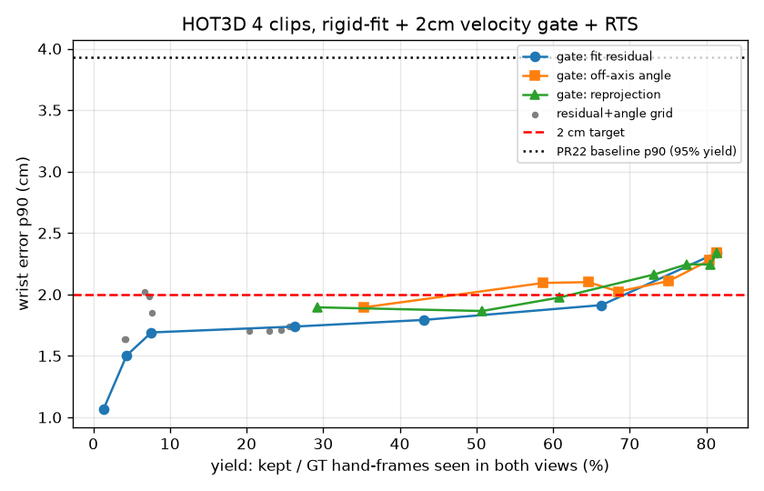

# 双目手腕误差的“尾巴”（最差 10%）：诊断与改进

> 本节表 1 的数字用的是旧默认：邻居中位数超过 **2 cm/帧** 就剔，RTS `q=0.3`。快动作评测（PR #29）之后，管线默认改成按时间的预测门限，并把 `q` 按速度取大约 30–300（见 [fast_motion.md](fast_motion.md)）。用同一批 WiLoR 缓存、同一 4 段 Quest3（600 帧）重跑后：**新默认**手腕中位 **1.13 cm**、p90 **2.38 cm**、≤2 cm **85%**（n=878），标注覆盖 **70.5%**；`--legacy-temporal` 对照为 1.11 / 2.29 / 87%（n=881），覆盖 70.7%（与 PR #24 一致）。表 1 保持旧消融原样，用来对照旧行为。

数据：HOT3D Quest3 4 段（clip-000000/000300/000700/001100），WiLoR 缓存结果（PR #22 的 run_main），
GT 手 989 只·帧（两目都认到）。误差 = 世界系手腕位置对真值。所有阈值只用无真值的量（重投影、角度、残差、速度）；
参数选择用“一段调参、其余三段测试”的 4 种轮换，从不在测试段的真值上调。实验脚本在 `/workspace/stereo_tail/`（未入库）。

## 1. 尾巴是什么造成的（PR #22 通过检查的 941 只·帧里最差 10% = 95 个）

| 类别 | 个数 | 说明 |
|---|---|---|
| 2D 手腕偏 >40 px（认错手/左右手搞混/遮挡） | 44 | 其中 24 个更接近**另一只手**的真值；12 个是同一只手被同时标成左手和右手 |
| 视野边缘（偏离光轴 >45°） | 17 | 去畸变后边缘像素被拉伸 |
| 左右两目 2D 不一致 → 深度错 | 10 | |
| 手腕置信度低 | 9 | |
| 其余（系统性偏差） | 15 | |

最差 10% 的误差 79% 在深度方向。手腕定义的固定偏移很小（各段中位数 ≤1 cm，方向不一致）：
在一段上估计手局部坐标系下的固定偏移、用到其余三段，p90 变化 +0.30 / −0.08 / +0.34 / +0.01 cm，中位数全部变差 → **不采用**。

## 2. 消融（4 段合并；产出 = 保留的手·帧 / 989）

| 方案 | 中位 cm | p90 cm | ≤2cm | 保留 | 产出 |
|---|---|---|---|---|---|
| PR #22（三角化手腕 + One Euro） | 1.25 | 3.93 | 75% | 941 | 95% |
| 不平滑 | 1.24 | 3.97 | 73% | 941 | 95% |
| + 重复检测去重 | 1.26 | 3.59 | 75% | 913 | 92% |
| 只换：刚体+尺度对齐 WiLoR 手型取手腕 | 1.31 | 3.69 | 75% | 941 | 95% |
| 只换：两目手型平均对齐 | 1.33 | 3.66 | 74% | 941 | 95% |
| 只加：速度门限 2 cm | 1.20 | 2.95 | 78% | 857 | 87% |
| 只换：RTS 平滑 | 1.23 | 3.26 | 77% | 941 | 95% |
| 对齐 + RTS（无门限） | 1.22 | 3.32 | 78% | 941 | 95% |
| 对齐 + 门限 3 cm + RTS | 1.14 | 2.52 | 82% | 871 | 88% |
| **对齐 + 门限 2 cm + RTS（新默认）** | **1.11** | **2.34** | **85%** | 805 | 81% |
| 新默认 + 去重 | 1.11 | 2.35 | 85% | 789 | 80% |
| 新默认 + 严格门限 中位重投影 ≤2 px | 1.06 | 1.98 | 90% | 602 | 61% |

没做：测试时翻转/多裁剪平均（要重跑 WiLoR，约 30 分钟/轮，留作下一步）。

## 3. 留出段结果（一段调参 → 其余三段测试）

4 种轮换里有 3 种选到完全相同的组合（对齐 + 门限 2 cm + RTS q=0.3），另一种只差在用三角化手腕。

| 调参段 | 留出三段 PR #22 p90 | 新方法 p90（中位 / ≤2cm / 产出） |
|---|---|---|
| clip-000000 | 4.60 | 2.53（1.06 / 80% / 81%） |
| clip-000300 | 3.59 | 2.40（1.14 / 85% / 82%） |
| clip-000700 | 4.78 | 3.49（1.10 / 81% / 86%） |
| clip-001100 | 2.66 | 2.10（1.06 / 89% / 82%） |

再加严格门限（在调参段上选“p90≤2 时产出最高”的重投影/角度门限）后，留出段 p90 为 2.26 / 1.82 / 1.73 / 2.09 cm，
产出 67% / 25% / 55% / 78%：**2 cm 的 p90 只能靠扔掉 20–75% 的帧换来，且不稳定**。

## 4. 结论

- p90 从 3.9 cm 降到约 2.3 cm（留出段 2.1–3.5 cm），代价是产出 95% → 约 81%。
- 在 HOT3D + WiLoR 上，不扔帧达不到 2 cm p90。剩下的尾巴主要是 WiLoR 在单张图上认错手/左右手搞混，
  后处理只能把它们剔掉。下一步要从检测下手：跨帧跟踪手的身份、翻转增强、或在自采数据上微调。
- 片段级 QC 不再把立体门限丢掉的帧算进 EgoDex 的 20% 坏帧。跳点（`jump`）、左右对不上（重投影 / 深度 / 手掌 / 关节太少 / 严格门限）、只有一目，以及补出来的帧，都是丢掉的标注：排除在坏帧之外，单独写成标注覆盖率（仍有实测标注的帧 / 总帧数）。门限把手腕拿掉之后，也不再把这段缺测记成手出画或摆拍。片段只因真正的片段问题被拒绝：手出画、视线飘移、运动模糊、摆拍或静止的坏帧比例超过 20%。另有独立参数 `--min-label-coverage`（代码里的 `min_label_coverage`，默认 0）：默认只把覆盖率写进报告，不因此拒绝片段。这个下限是临时的，等真实头戴数据再定，不要当成已经标定的门限。新 QC 下重跑：四段全部通过（4/4；各段坏帧 0% / 8.0% / 0.7% / 7.3%，均低于 20%）。标注覆盖 70.5%（新默认）/ 70.7%（`--legacy-temporal`）。想要 PR #22 的几何行为用 `--smooth one_euro --wrist-mode tri --velocity-gate-m 0`。

## 5. 新默认（PR #29）重跑

同一批缓存的 WiLoR 候选/重裁（PR #24 的 `hand_assoc` 缓存），`scripts/run_stereo_pipeline.py`，
4 段 Quest3（clip-000000/000300/000700/001100，各 150 帧）。手腕误差取报告里的「最终：平滑后、测到的帧」。

| 设置 | 手腕中位 / p90 / ≤2cm | 标注覆盖 | 片段 QC | 有效动作比例 |
|---|---|---|---|---|
| **新默认**（`predicted` 门限 + RTS q=auto≈30–300，补洞按秒） | **1.13 / 2.38 / 85%**（n=878） | **70.5%**（423/600） | **4/4 通过** | **64.3%**（导出 596 帧） |
| `--legacy-temporal`（每帧 2 cm + q=0.3，补洞按帧） | 1.11 / 2.29 / 87%（n=881） | 70.7%（424/600） | 4/4 通过 | 63.8%（导出 596 帧） |

慢动作上新旧默认几乎一样：新默认略松一点跳点门限（跳点 102 vs 99），p90 高约 0.1 cm，覆盖低约 0.2 个百分点。有效动作比例来自 LeRobot 导出的 `valid_action_ratio`（左右手各自计）。
