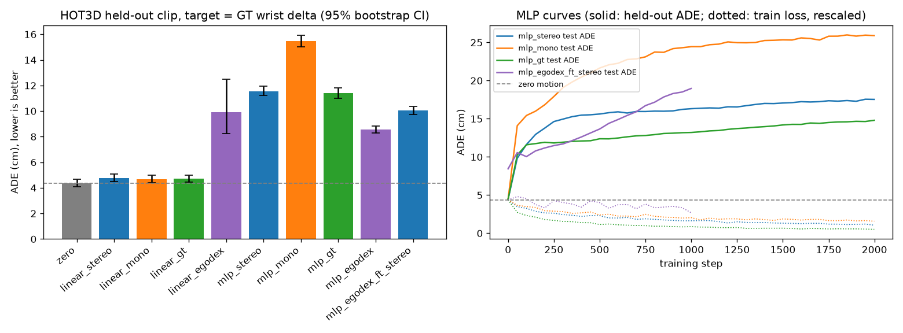

# 用 HOT3D 双目标签训练小模型：标签真的对训练有帮助吗？

结论先说：**现在测不出来。** 596 帧太少，不管用双目标签、单目 WiLoR 标签，还是动捕真值（理论上限）训练，模型都**没能**比"保持不动"更好地预测下一段手腕运动。三种标签训出来的结果几乎一样，所以这次实验既不能说明双目标签有用，也不能说明它没用——瓶颈在数据量，不在标签质量。

所有数字由 `scripts/hot3d_train_compare.py` 生成，原始结果在 `docs/hot3d_stereo/train_compare/metrics_*.json`，没有手填。

## 1. 用了什么数据
- `scripts/run_stereo_pipeline.py --hot3d` 跑出来的 HOT3D Quest3 4 个片段（clip-000000/000300/000700/001100），每段 150 帧（30 fps，5 秒），去掉每段最后一帧共 **596 行**动作，就是导出到 LeRobot 的那份。
- 同一批帧准备了三份"手"标签：

| 标签来源 | 手腕位置和真值的差（中位数 / 90%） | 有效动作比例 |
|---|---|---|
| 双目（流水线导出） | 1.25 / 3.12 cm | 68% |
| 单目 WiLoR（左目 3D，用 SLAM 位姿转世界系） | 2.59 / 5.51 cm | 78% |
| HOT3D 动捕真值（上限） | 0 | 100% |

双目标签确实比单目准一倍左右，这是之前已经验证过的。这次想回答的是：**更准的标签能不能训出更好的模型**。

## 2. 怎么比才公平
- **同一个任务**：和 EgoDex ACT 实验（`docs/egodex_act_results.md`）完全一样——输入 140 维手部状态，预测未来 16 步、每步 14 维的双手手腕增量（位移 + 相对旋转）。指标直接调用 `scripts/egodex_act_eval.py` 的 `metrics_for`，所以数字和 EgoDex 那张表是同一套定义。
- **同一个正确答案**：不管用哪种标签训练，测试时都和**动捕真值**的手腕运动比。
- **没见过的片段**：留一片段交叉验证——用 3 个片段训练，在第 4 个上测，轮换 4 次，汇总全部 4 个测试片段（每片段 135 个 16 步动作块）。
- **同样的模型**：
  - 线性 BC：和 EgoDex 实验同一个岭回归。
  - 小 MLP：140→256→256→16×14，只在有效手上算损失（和 ACT 的掩码一致），CPU 训练，**5 个随机种子**。
  - 没训 ACT：596 帧、4 个片段训图像 ACT 只会更过拟合，CPU 上也不划算。
- **超参不偷看答案**：主表（下面第 3 节）的正则强度（岭回归 l2）和 MLP 训练步数，只在训练用的 3 个片段里再做一次留一选出来，而且只用该来源自己的标签，不看测试片段、不看真值。
- **EgoDex 对照**：用 `docs/egodex_act/split.json` 的 train（272 条 episode，19,725 个动作块）训练同样的模型，直接拿到 HOT3D 上测；以及"EgoDex 预训练 + HOT3D 双目标签微调"。

## 3. 结果（HOT3D 留出片段，目标 = 真值；越低越好）

主表（`metrics_tune_abs.json`，输入是原始 140 维状态，和 EgoDex 实验一致）：

| 方法 | 单步位移误差@1 (cm) | 累计位移@8 (cm) | 累计位移@16 (cm) | 累计旋转@16 (°) | ADE (cm) [95% CI] | 比零动作差多少 (cm) |
|---|---|---|---|---|---|---|
| 零动作（保持不动） | 0.60 | 4.30 | 7.67 | 22.7 | **4.37** [4.09, 4.66] | 0 |
| 线性 BC · 双目标签 | 0.65 | 4.68 | 8.45 | 24.3 | 4.78 [4.51, 5.07] | +0.41 |
| 线性 BC · 单目标签 | 0.65 | 4.62 | 8.21 | 25.6 | 4.69 [4.42, 4.98] | +0.32 |
| 线性 BC · 真值标签（上限） | 0.65 | 4.61 | 8.27 | 23.4 | 4.70 [4.44, 4.99] | +0.33 |
| MLP · 双目（5 种子） | 1.67 | 11.78 | 19.27 | 59.5 | 11.56 [11.21, 11.93] | +7.19 |
| MLP · 单目（5 种子） | 1.98 | 14.90 | 28.26 | 61.6 | 15.46 [15.02, 15.91] | +11.09 |
| MLP · 真值（5 种子） | 1.62 | 11.34 | 19.44 | 58.4 | 11.40 [11.01, 11.79] | +7.03 |
| 线性 BC · EgoDex 训练 | 1.14 | 9.46 | 18.36 | 43.9 | 9.93 [8.25, 12.50] | +5.56 |
| MLP · EgoDex 训练（5 种子） | 0.96 | 8.15 | 15.73 | 41.2 | 8.56 [8.30, 8.84] | +4.19 |
| MLP · EgoDex 预训练 + 双目微调 | 1.41 | 9.76 | 18.10 | 53.9 | 10.04 [9.72, 10.37] | +5.66 |

MLP 种子间标准差 0.2–1.2 cm。内层选参的结果：岭回归每一折都选了最大的 l2（1000），MLP 几乎都选了最少的 100 步——意思是"越少学越好"，模型基本退回到预测平均值。



右图是 MLP 的学习曲线（固定训 2000 步那一轮，`metrics_untuned_abs.json`）：训练损失（虚线）一路下降，而留出片段上的误差（实线）从第一步开始就往上走——**典型的过拟合**：模型在背 3 个片段，而不是学会手怎么动。

### 补充实验
- **固定超参（和 EgoDex 一样的 l2=1e-3，MLP 2000 步）**：所有模型都差得多，线性 BC 双目 29.8 cm、真值 47.1 cm，MLP 双目 17.5 cm、真值 14.8 cm（`metrics_untuned_abs.json`）。
- **平移不变的输入**（关节减去手腕位置、去掉绝对坐标，`--features local`）：换了输入也一样，选好超参后线性 BC 双目 4.79、真值 4.68、单目 4.68 cm，仍然都不如零动作（`metrics_tune_local.json`）。

## 4. 怎么理解这些数字
1. **没有任何模型赢过"保持不动"。** 最好的是选了强正则的线性 BC，比零动作差约 0.3–0.4 cm；MLP 差 7 cm 以上。
2. **三种标签之间几乎没有差别。** 线性 BC 双目 4.78、单目 4.69、真值 4.70 cm，差距比片段之间的差异小得多（零动作在 4 个片段上分别是 8.2 / 2.7 / 2.1 / 4.4 cm）。连"完美标签"都没帮上忙，说明此时限制结果的是**数据量**，不是标签精度。所以这次实验**不能**证明"双目标签对训练有帮助"，也不能证明"没有帮助"。
3. **EgoDex 训的模型拿到 HOT3D 上也不行**（MLP 8.56 cm，比零动作差一倍）。EgoDex 和 HOT3D 的世界坐标原点、任务、手腕姿态的来源都不一样，模型没法直接搬。用双目标签微调后反而更差（10.04 cm），因为又在 3 个片段上过拟合了。作为参考，EgoDex 自己的 test 集上，ACT 也只比零动作好约 3%（见 `docs/egodex_act_results.md`），说明"只看当前一帧手的姿势去猜下半秒怎么动"本来就很难。
4. **置信区间要打折扣看。** 表里的 95% CI 是在动作块上做 bootstrap 得到的，但相邻的块几乎重叠（步长 1），而且总共只有 4 个片段，真实的不确定性比括号里的范围大得多。能放心下结论的只有"都不如零动作"这一条。

## 5. 想真正回答"双目标签有没有用"，需要什么
- **更多片段**：至少几十到上百段、多个场景。HOT3D 公开数据里还有很多 Quest3 序列，可以批量跑双目流水线（每段 5 秒约几分钟 CPU）。
- **加图像/历史帧输入**：只给当前一帧手的姿势，模型猜不出意图；EgoDex 的 ACT 用了图像也只是略好于零动作。
- **用下游指标**：比如拿标签做人手→机械手重放（`docs/` 里的 retargeting），看双目和单目标签的轨迹差多少，这比训练小模型更直接地反映标签质量。

## 6. 复现
```bash
python scripts/hot3d_train_compare.py --run <run_stereo_pipeline 输出目录> \
  --egodex <EgoDex LeRobot 目录> --egodex-split docs/egodex_act/split.json \
  --tune 1 --features abs --seeds 5 --out out_tune_abs
python scripts/plot_hot3d_train_compare.py --dir out_tune_abs --curves out_untuned --out train_compare.png
```
CPU 8 核，每组约 10–30 分钟。
