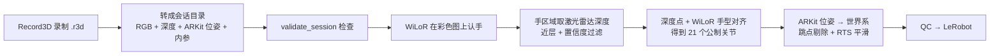

# 用 iPhone Pro 采集手部数据（Record3D + 激光雷达）

> 适用：iPhone 12 Pro 及以后的 Pro / Pro Max（背面有激光雷达）。普通 iPhone 没有激光雷达，不能用这条流程。
> 代码：`scripts/iphone/record3d_adapter.py`（导出 → 会话目录）、`scripts/headcam/rgbd_pipeline.py`（深度求手）、
> `scripts/run_stereo_pipeline.py --iphone`（一条命令）、`scripts/validate_session.py`（录制检查）。
> 精度评测见文末“精度”一节，**实测和仿真分开标注**。

## 1. 这条流程做什么



和双目管线的区别只在“手离相机多远”这一步：双目靠左右两目三角化，iPhone 靠激光雷达直接测距；
相机在空间里的位置由 ARKit 给出（代替双目设备上的 SLAM）。后面的平滑、质检、导出完全共用。

## 2. 需要准备什么

| 东西 | 说明 |
|---|---|
| iPhone Pro（带激光雷达） | 12 Pro 及以后 |
| Record3D App | App Store 搜 “Record3D”。部分导出 / 串流功能是付费扩展，以 App 内说明为准；本流程只需要 `.r3d` 导出 |
| 固定支架 | 头戴手机支架（推荐，最接近头戴设备视角）或胸前手机支架（次选）。不要手持 |
| 电脑 | 已经配好本仓库和 WiLoR 环境（`source /workspace/stereo_env.sh`） |

## 3. 录制步骤

1. **打开 Record3D → 设置（Settings）**：
   - 摄像头选 **后置激光雷达（LiDAR）**，不要选前置 FaceID 摄像头（前置深度不是激光雷达，管线会在检查时报“有效深度太少”或尺寸不对）。
   - 如果有 “Higher quality LiDAR recording / 更高质量 RGB” 一类选项，打开。
   - 帧率选 30 fps 即可（60 fps 文件大一倍，可用 `--stride 2` 抽帧）。
2. **固定手机**：
   - **头戴**：手机横放在额头前，镜头朝前下方约 30–45°，让双手在桌面操作时都在画面中间偏下。
   - **胸前**：胸前支架，镜头朝前下方。视角比头戴低，手更容易挡住物体，只适合先跑通流程。
   - 激光雷达有效距离约 0.25–5 m，手离手机 **至少 25 cm**，最好 30–70 cm。太近深度会缺失。
3. **环境和光线**：
   - 室内均匀照明，避免强逆光和阳光直射（阳光会干扰激光雷达）。
   - 桌面别全是白色无纹理，也别是镜面 / 玻璃 / 黑色吸光布（深度置信度会很低，ARKit 也容易跟丢）。
   - 录制前先拿着手机在场景里缓慢转一圈 2–3 秒，让 ARKit 建好定位，再开始做动作。
4. **录制**：点红色按钮开始，做完一个任务停止。一段 10–60 秒为宜。动作正常速度，不要故意很快。
   开头和结尾各留 1 秒双手静止，方便切分。不要遮挡镜头，不要突然甩头（ARKit 位姿会跳）。
5. **任务说明（可选但推荐）**：每段录完后，在电脑上会话目录的 `metadata.json` 里补 `task`、`instruction`、
   `environment`、`objects`、`verbs`（格式同 `docs/headcam_data_spec.md` §8）。

## 4. 导出和传到电脑

1. Record3D → **Library（资料库）** → 在要导出的视频上向左滑 → **Export** → 选 **`.r3d`**
   （也支持 “EXR + JPG” 序列，适配器两种都能读）。
2. 传到电脑：AirDrop（Mac）、iOS “文件” App → Record3D 文件夹 → 存到网盘，或数据线 + Finder/iTunes 文件共享。
3. 把 `.r3d` 放到电脑上一个目录，例如 `~/iphone_raw/`。

## 5. 一条命令处理

```bash
source /workspace/stereo_env.sh            # WiLoR / MANO 环境变量
cd /workspace/robot
# 1) 先检查（转换 + 校验，不跑模型，几秒钟）
python scripts/iphone/record3d_adapter.py ~/iphone_raw/take1.r3d --out outputs/iphone/sessions/take1
python scripts/validate_session.py outputs/iphone/sessions/take1
# 2) 一条命令跑完：转换 → 认手 → 激光雷达深度 → 世界系 → 平滑 → QC → LeRobot
python scripts/run_stereo_pipeline.py --iphone ~/iphone_raw/*.r3d --out outputs/iphone
```

输出和双目一样：`outputs/iphone/report.md`（产出率、每段是否通过、被丢的原因）、`episodes/*.json`、
`qc/yield.html`、`lerobot/`（LeRobot v3.0）。每行 `action` 旁有 `action_valid`，形状 `(2,)`（左、右）：
当前帧和下一帧该手都是实测手腕才为 1。`lowconf`、`fit`、`tracking`、`jump` 等丢掉的帧是 0，占位增量仍留在 `action` 里。
质检和 `meta/egodata_export.json` 会写有效动作比例，以及 16/50/100 步整段窗口比例（片段比窗口短时为空，不写成 0）。
WiLoR 结果缓存在 `outputs/iphone/cache/`，改参数重跑只要几秒。
WiLoR 环境的 numpy 太老导不了 pyarrow 时，加 `--export-python /path/to/python`。

### validate_session 对 iPhone 会话查什么

| 检查 | 不通过时 |
|---|---|
| rgb.mp4 / depth.npz / timestamps.csv 帧数一致，视频尺寸与内参一致 | ERROR |
| 有效深度像素 ≥ 50% | ERROR（多半是用了前置摄像头或深度没录上） |
| 高置信深度 ≥ 30% | WARN（太暗、太远、反光） |
| 实测帧率与 metadata.fps 一致、时间戳递增 | ERROR |
| 有 ARKit 位姿（slam.tum）且覆盖每一帧 | ERROR |
| ARKit 位姿速度超过 3 m/s 或 600 °/s 的帧超过 1% | WARN（Record3D 不导出 ARKit 跟踪状态，用速度代替；3 m/s 和 600 °/s 等于旧的 10 cm/帧、20°/帧 在 30 fps 下的值，换帧率不变） |
| 曝光锁定和逐帧曝光（有 `exposure.csv` 或 metadata 里的曝光字段时） | 超过 5 ms 为 ERROR；没写只 WARN（Record3D 多数导出没有曝光） |

### 管线里逐手的检查（被丢的帧会在 report.md 里列出原因）

| 状态 | 含义 |
|---|---|
| `lowconf` | 手所在区域高置信激光雷达深度不足 30% |
| `few_joints` | 能取到合理深度的关节少于 8 个 |
| `depth` | 手腕深度不在 0.25–1.5 m |
| `fit` | 激光雷达深度点和 WiLoR 手型对不上（对齐残差 > 2 cm 或尺度不在 0.75–1.33） |
| `palm` | 手掌长度不在 5–15 cm |
| `tracking` | 这一帧 ARKit 位姿速度超过 3 m/s 或 600 °/s（按时间，不按“每帧多少厘米”） |
| `jump` | 世界系手腕相对匀加速预测的残差 > 2 cm，或速度 / 加速度超过上限（默认 8 m/s、80 m/s²）。旧的“每帧 2 cm”要用 `--legacy-temporal` |

这些阈值是按传感器常识先定的临时值，**没有在真值上调过**；等你第一批真实录制回来再按 report.md 调整。

## 6. 会话目录格式（适配器输出）

| 文件 | 内容 |
|---|---|
| `rgb.mp4` | 彩色，原始分辨率 |
| `depth.npz` | `depth` (N, dh, dw) float16 米；`conf` (N, dh, dw) uint8，0/1/2 = 低/中/高 |
| `calib.yaml` | JSON：`sensor: iphone_lidar`、`K_rgb`、RGB 尺寸、深度尺寸 |
| `slam.tum` | ARKit 位姿，已从 OpenGL 相机约定（y 上、z 后）转成 OpenCV（y 下、z 前），`T_world_cam`；世界系 y 轴朝上（重力对齐） |
| `timestamps.csv` | `frame,timestamp_s`（来自 Record3D `frameTimestamps`，没有就按 fps 推） |
| `metadata.json` | fps、设备、来源文件；可补任务标注 |

Record3D `.r3d` 的解析依据：`metadata` 里 `K` 是列主序 3x3、`poses` 每帧 `[qx,qy,qz,qw,tx,ty,tz]`、
深度是 LZFSE 压缩的 float32（米），置信度是 LZFSE 压缩的 uint8（参考 Record3D 作者在 GitHub issue #88 的说明，以及
viser / instant-ngp 的 Record3D 读取代码）。读 `.r3d` 需要 `pip install pyliblzfse`。
**还没有用你手机录的真实 `.r3d` 验证过**，单元测试用的是按同样格式合成的样例；第一段真实录制请先跑 `validate_session`。

## 7. 和头戴双目的差别（要知道的限制）

- 视角：手机挂头上 / 胸前，视场约 60–70°（主摄），比计划的 100° 双目窄，手更容易出画。
- 深度只有 256x192，手指这种细的东西取不到可靠深度；所以只用深度定“整只手在哪”，手型来自 WiLoR。
- 手在物体前面时，深度在手的边缘会混到背景（边缘平滑）；管线取手区域的“近层”并用 3x3 中位数，减轻这个问题。
- 手和物体贴在一起（握住物体）时，近层可能是物体表面，误差会偏大。
- 现在 iPhone 路线没用双目管线里的“翻转 TTA + 左右目关联”（那一步依赖两目），只用了 WiLoR 默认输出。

## 8. 精度

见 `docs/iphone_capture_eval.md`（DexYCB 真实 RGB-D + 3D 手部真值，实测；以及降质成 iPhone 激光雷达特性的仿真）。
