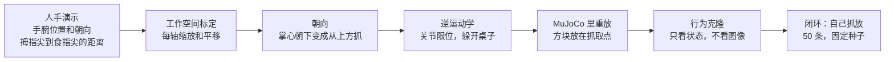
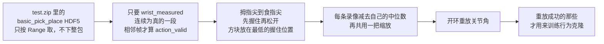
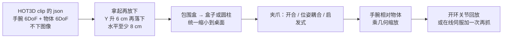

# 人手演示怎么在仿真里变成机械臂

这份说明给第一次看的人。目标只有一个：把「手腕在哪儿、手张得多大」变成仿真里一台机械臂的动作，先原样重放，再拿这些动作训练一个小策略，看它自己能不能把方块放到指定位置。

仓库里不提交 16GB 的 EgoDex `test.zip`，也不提交 HOT3D 的 tar。合成演示、真实 EgoDex、HOT3D 三套成功率分开写，不要混在一张表里。合成数字来自 `docs/retarget_sim_results.json`。EgoDex 开环基线来自 `docs/retarget_egodex_results.json`。物体位姿、抓取时机和在线修正的消融在 `docs/retarget_hot3d_results.json`。

## 一张图



## 选了什么

| 项目 | 选择 | 原因 |
|---|---|---|
| 任务 | 桌面抓放，对应 EgoDex 的 `basic_pick_place` | 只有抓起和放下，成功与否能用方块位置判断 |
| 机器人 | MuJoCo 里自带的 6 轴臂加平行夹爪 | 运动学类似 Franka（底座转动、肩、肘、三个腕关节）。不用官方 Panda 网格，也不用 robosuite / ManiSkill / LIBERO |
| 计算 | CPU、无头 | 这条链路不需要 GPU。`pip install mujoco` 之后本次整段评测 35.9 秒跑完 |
| 策略 | 两层小网络的行为克隆 | 没有装 torch。图像 ACT 仍然留在 Colab 笔记本里，不在这里训 |

夹爪靠指垫和摩擦把方块夹起来，没有吸盘，也没有「碰到就焊住」的简化。

## 重定向在做什么

人手坐标和机器人坐标不是同一套。合成演示里，手在一个更大、更高的盒子里动；机器人只能在桌子前方的一小块里动。标定按三个轴各自做：

`机器人坐标 = 缩放 × 人手坐标 + 平移`

缩放和偏移可以用两组对应点做最小二乘，也可以直接用两只盒子的边界。合成数据用的是后一种，三个轴的缩放大约是 0.333、0.533、0.457（写在结果 JSON 里）。

朝向：手腕旋转乘一个固定的工具旋转。人手「掌心朝下」（腕部旋转是单位阵）对应夹爪竖直向下。绕竖直轴转一下，接近方向仍然朝下。

开合：拇指尖（第 4 点）到食指尖（第 8 点）的距离。张开约 8 cm 以上夹爪全开，小于约 2.5 cm 夹紧，中间线性过渡。

逆运动学用阻尼最小二乘，关节角夹在限位里。连杆撞到桌子时，把目标抬高 2 cm 再解，最多 5 次。这次 20 条回放里没有发生抬升。

## 怎么算成功

方块中心离目标点的水平距离 **不超过 4 cm**，并且高度还在 0.20 m 到 0.30 m（停在桌面上，没有飞走或掉下去）。起点和目标至少隔开 12 cm，所以方块完全没动不会被算成成功。

评测种子：

| 用途 | 种子 |
|---|---|
| 40 条人类训练演示 | 0–39 |
| 40 条机器人训练演示 | 1000–1039 |
| 20 条留出回放 | 2000–2019 |
| 50 条闭环评测（四种方法共用） | 3000–3049 |

混合策略用人类的前 20 条加机器人的前 20 条，总数仍是 40，不是把两边拼成 80。

每种策略只训了 **一个** 网络种子（人类 10、机器人 11、混合 12）。下面的 50 条是换了桌面摆放之后的闭环，不是训练种子的平均。

## 合成数据上测到的数

来源：`docs/retarget_sim_results.json`（由 `python scripts/sim/run_benchmark.py` 写出，`elapsed_s` = 35.9）。这是合成的 EgoDex 式轨迹，不是录像。

回放（开环，把求好的关节角放进仿真）：

| 项目 | 结果 |
|---|---|
| 重定向后的人类轨迹，留出 20 条 | **20/20**，水平误差平均 0.0013 m |
| 这 20 条的 IK 位置误差 | 每条中位数再取中位数 **0.000938 m**；单帧最大不超过 0.00100 m |
| 标定之后，闭合点对照设计好的方块位置 | 误差是数值上的 0（合成路径来回映射，不是真实感知） |
| 用来训练的 40 条人类演示、40 条机器人演示，教师自己执行 | 都是 **40/40** |

闭环（同一 50 个种子，时限 5.9 秒）：

| 方法 | 成功 | 成功率 | 结束时水平误差平均 |
|---|---|---|---|
| 脚本专家（知道起点和目标，走规划好的路径） | 50/50 | 100% | 0.0013 m |
| 行为克隆，只用重定向后的人类演示 | 23/50 | 46% | 0.0888 m |
| 行为克隆，只用 40 条机器人演示 | 20/50 | 40% | 0.0922 m |
| 行为克隆，人类 20 条 + 机器人 20 条 | 34/50 | 68% | 0.0646 m |

成功的那些，方块几乎就在目标上（混合策略的误差中位数是 0.0026 m）。失败的那些通常是没夹起来，方块还在起点，所以平均误差会到好几厘米。

训练集上，路点编码（沿起点到目标的比例、侧向、高度）的均方误差是：人类 0.000620，机器人 0.000766，混合 0.000865。这只说明网络记住了演示里的路点，**不是**上面的成功率。

混合这一次比单独训练高，只代表种子 12 的这一次。没有再换训练种子重跑，不要把它写成「混合一定更好」。

## 真实 EgoDex basic_pick_place

合成路径是规则的。真实录像的原点每条都不一样，开合也没有 2.5 cm / 8 cm 那么整齐，而且 HDF5 里没有物体位姿。下面这条链路只为真实片段服务。



下载命令（文件在 `data/`，gitignore，不会进仓库）：

```bash
python scripts/retarget/fetch_egodex.py --dest data/egodex_basic_pick_place
python scripts/sim/run_egodex_benchmark.py --out docs/retarget_egodex_results.json
```

这次 `test.zip` 能按 Range 取到。`basic_pick_place` 有 277 个 HDF5，全部写到本地，没有失败。不需要 mp4。

怎么筛：

| 步骤 | 条数 | 原因 |
|---|---|---|
| 压缩包里的 HDF5 | 277 | `test/basic_pick_place/0.hdf5` 到 `276.hdf5` |
| 主动手有一段够长的实测，并且能找到一次「握住再松开」、水平位移至少 5 cm | 163 | 其余 114 条：67 条张合对不上，39 条既对不上又太短，6 条实测段太短，2 条开合几乎不变 |
| 映射到桌面后，起点和目标至少隔开 6 cm | 101 | 又去掉 62 条。成功半径是 4 cm，隔开不到 4 cm 时方块不动也会被算成功 |

主动手优先读标注里的 `hand:left` / `hand:right`。163 条里右手 134、左手 29；标了某一只但那只手没有抓放、改用另一只的有 1 条（进了后面 101 条的是右手 80、左手 21，其中 1 条是改用的另一只手）。

竖直方向：抓住之后到松开之前，手腕升高的中位数是 X 0.001 m、Y 0.092 m、Z 0.008 m。89.6% 的片段 Y 至少升高 2 cm。所以按 ARKit 的习惯把 Y 当朝上，再转成机器人的 Z。人手 X 映射到机器人左右，人手 Z 映射到前后。

标定只拟合一次：每条录像先减去自己手腕的中位数（每条录像的 ARKit 原点不同，不能把绝对坐标堆在一起），再用全部 163 条的分布确定缩放。三个轴的缩放是 0.619、0.626、1.258。没有按每一条把方块搬到固定格子上。抓住那一下如果还在半空，方块放在「已经握住、手腕最低」的那一帧，而不是张开幅度刚跨过阈值的那一帧。

朝向没有用前臂关节的旋转。EgoDex 的 `Hand` 在前臂上，不是掌心。夹爪固定从上方接近。开合按这一段自己的 10%–90% 分位归一化，不用合成数据的绝对厘米数。

逆运动学在这 101 条上是准的：每条中位位置误差再取中位数 **0.000941 m**，所有帧里最大的一次是 0.00376 m。没有为了躲桌子把目标抬高，也没有连杆撞桌子。重放失败不是因为手够不到。

开环重放（把求好的关节角放进仿真，夹爪在 0.3 秒到位期间保持张开，避免合着爪把方块推走）：

| 项目 | 结果 |
|---|---|
| 101 条全部 | **15/101**（14.9%），水平误差平均 0.0946 m，中位数 0.0912 m |
| 其中训练池 51 条 | 8/51 |
| 留出的 50 条 | 7/50 |
| 失败的 86 条里，方块移动不到 1 cm | 65 条。多数是没夹起来，不是夹起来之后放歪 |
| 成功的 15 条，结束时水平误差中位数 | 0.0121 m |

闭环评测用序号最大的 50 条留出场景，三种方法、三个种子都看这同一批。脚本专家 **50/50**，平均水平误差 0.00103 m。所以这些场景本身能被这只夹爪完成，差在重放和策略。

行为克隆原本想看 20 / 40 / 80 条。训练池里开环重放成功的只有 **8** 条，80 条和 40 条、20 条都不够，所以只训了这一档。失败的重放没有拿去当演示：方块没动，标签却说要搬走，会把策略教反。机器人演示是这同样 8 个起点和目标上的脚本路径。混合是前 4 条人类加重前 4 条机器人，总数仍是 8。每条演示抽成 59 步，避免长片段占更多权重。时限 5.9 秒。网络种子：人类 0、1、2，机器人 100、101、102，混合 200、201、202。标准差是这 3 个成功率的样本标准差。

| 方法 | 种子 0 | 种子 1 | 种子 2 | 均值 ± 标准差 |
|---|---|---|---|---|
| 行为克隆，8 条重放成功的人类演示 | 0/50 | 0/50 | 0/50 | **0% ± 0** |
| 行为克隆，同样 8 个场景的机器人演示 | 12/50 | 18/50 | 11/50 | **27.3% ± 7.6 个百分点** |
| 行为克隆，人类 4 条 + 机器人 4 条 | 0/50 | 3/50 | 1/50 | **2.7% ± 3.1 个百分点** |

三个种子的路点均方误差：人类 0.0100、0.0103、0.0095；机器人 0.00128、0.00096、0.00095；混合 0.00606、0.00656、0.00603。人类这一档训练集上就没记住路点，闭环是 0，两件事是一致的。机器人这一档换种子会从 22% 到 36%，不要写成一个固定的 27%。

整段评测 `elapsed_s` = 61.2，CPU，无头，没有 GPU。

## 物体位姿、抓取时机、在线修正

上一节的 15/101 只用手腕和开合。这一节加三件事，阈值在看成功率之前就定好，没有按结果再改：

1. HOT3D-Clips（Quest3）里有物体 6DoF。挑「Y 升高至少 6 cm、再落回起点高度 4 cm 以内、水平搬走至少 8 cm、抬的时候有一只手离包围盒中心不超过 25 cm」的段。仿真物体用 `models_info.json` 的包围盒：最长边缩到不超过 8 cm，不放大。能被夹爪夹住的那一轴（缩放后落在 2.6–7.0 cm，夹爪合拢间隙是 2.4 cm）对准夹爪。连续对称的用圆柱，其余用盒子。朝向轴对齐，成功仍只看水平 4 cm。
2. 夹爪不再只跟开合距离走。HOT3D 没有用 MANO，所以没有皮肤接触真值。位姿耦合是：这只手更近、距离 ≤ 25 cm、物体速度 ≥ 5 cm/s、而且和手腕同向（余弦 ≥ 0.5），合上时刻再提前 3 帧。估计器是 PR #27 的启发式：HOT3D 的指尖是手腕坐标系里的固定模板，表面是包围盒 8 个角，来源写的是 `heuristic`，不是 `hot3d_mesh`。
3. 接近和抓住时，手腕相对物体的位移乘物体自己的几何缩放，好让缩小后的物体边上还够得到手。起点和终点仍用工作空间那把缩放，搬运不会被缩没。靠近物体时，末端每步最多走向「仿真里的物体 + 这个偏移」1.5 cm；没抬起超过 1 cm 就再抓一次（张开、抬 3 cm、下降、合上）。



EgoDex 没有物体位姿。能搬过去的只有：握住区间里把夹爪合死（仍由开合滞回定区间）、把抓住那一帧的高度对齐到夹取高度、以及在线伺服到仿真方块（偏移是 0）并最多再抓一次。不把这叫成网格真值。

```bash
python scripts/retarget/fetch_hot3d.py --dest /tmp/hot3d --count 64
python scripts/sim/run_retarget_v2.py --hot3d /tmp/hot3d --egodex data/egodex_basic_pick_place --out docs/retarget_hot3d_results.json
```

这次下了 `train_quest3` 的 clip-000000 到 clip-000063，只留 json。384 条物体轨迹里，21 条通过上面的拿起再放下，映射后有 1 条起点和终点近于 6 cm，剩下 **20** 条进入重放。其中 16 条缩放后夹得住，4 条夹不住（键盘、两把木勺、遥控器）也照样重放，不因为会失败就丢掉。

HOT3D 重放（20 条，成功半径 4 cm）：

| 消融 | 成功 | 水平误差平均 | 方块移动不到 1 cm |
|---|---|---|---|
| 刚性：映射后的手腕，距离当作开合 | 0/20 | 0.1343 m | 14 |
| 同一条手腕，夹爪按位姿耦合 | **1/20** | 0.1231 m | 12 |
| 同一条手腕，夹爪按启发式 | 0/20 | 0.1325 m | 15 |
| 物体相对轨迹，开环 | 0/20 | 0.1448 m | 17 |
| 手腕轨迹 + 在线伺服和一次再抓 | 0/20 | 0.1322 m | 10 |
| 三者合在一起 | 0/20 | 0.1451 m | 17 |

唯一成功的是 clip-000026 的白板擦，只在「位姿耦合」这一行，结束时水平误差 0.0025 m。启发式在这 20 条上抓住帧数都是 0：固定指尖模板到不了 1 cm 的接触门限。物体相对偏移的中位数还有 0.087 m，末端没有贴到物体上。在线和合并这两行，20 次全部走了再抓，第一次伺服都没有把物体抬高 1 cm。行为克隆没有训：训练池里合并方法成功 0 条。留出了 4 条，但没有成功演示可以学。

同一条 101 条 EgoDex 上，刚性重放和上一份 JSON 是同一 15 条（成功集合一致）。其余行是这次新加的：

| 消融 | 成功 | 水平误差平均 | 方块移动不到 1 cm |
|---|---|---|---|
| 刚性（上一份的开环） | **15/101**（14.9%） | 0.0946 m | 65 |
| 握住到松开之间夹爪合死，提前 3 帧 | **41/101**（40.6%） | 0.0722 m | 54 |
| 启发式，方块放在抓住帧的指尖中心 | **0/101** | 0.1101 m | 88 |
| 只把抓住帧高度对齐到夹取高度 | **21/101**（20.8%） | 0.0899 m | 49 |
| 在线伺服 + 一次再抓，夹爪仍跟开合 | **32/101**（31.7%） | 0.0716 m | 34 |
| 高度对齐 + 合死 + 在线再抓 | **89/101**（88.1%） | 0.0351 m | 0 |

启发式几乎没有判成抓住：101 条里 91 条抓住帧数是 0，最多 1 帧。在线和合并这两行，**101 次都走了再抓**。伺服结束时方块都没有升高 1 cm。所以 32/101 和 89/101 测的是「第一次没抬起来之后的那一次再抓」，不是第一次就夹住再修一点残差。再抓读的是仿真里方块的坐标，不是相机。合并更高，是因为再抓之后夹爪一直合到松开，开合距离那一档常常中途张开，方块掉回去。成功的 89 条，结束时水平误差中位数 0.0089 m。留出的 50 条里这一合并重放是 44/50，训练池 51 条里成功 45 条。

闭环仍用留出的 50 条场景，脚本专家 **50/50**，平均 0.00103 m。行为克隆只在合并重放成功的演示上训，机器人演示是同样的起点和目标。45 条凑不满 80，所以缩放是 20、40 和 45。45 这一档混合是前 22 条人类加前 22 条机器人，一共 44，不是 45。三个网络种子和上一节相同。标准差是样本标准差。

| 方法 | 种子 0 | 种子 1 | 种子 2 | 均值 ± 标准差 |
|---|---|---|---|---|
| 人类，20 条 | 0/50 | 2/50 | 0/50 | **1.3% ± 2.3 个百分点** |
| 机器人，20 条 | 9/50 | 17/50 | 19/50 | **30.0% ± 10.6 个百分点** |
| 混合，10 + 10 | 5/50 | 3/50 | 2/50 | **6.7% ± 3.1 个百分点** |
| 人类，40 条 | 3/50 | 8/50 | 1/50 | **8.0% ± 7.2 个百分点** |
| 机器人，40 条 | 15/50 | 14/50 | 23/50 | **34.7% ± 9.9 个百分点** |
| 混合，20 + 20 | 14/50 | 5/50 | 9/50 | **18.7% ± 9.0 个百分点** |
| 人类，45 条 | 0/50 | 2/50 | 2/50 | **2.7% ± 2.3 个百分点** |
| 机器人，45 条 | 5/50 | 14/50 | 24/50 | **28.7% ± 19.0 个百分点** |
| 混合，22 + 22 | 4/50 | 5/50 | 7/50 | **10.7% ± 3.1 个百分点** |

重放 89/101 不能当成策略会抓。策略学的是阶段路点，闭环里没有那个再抓控制器，人类这一档最高的一个种子是 8/50。机器人演示仍高于人类演示。40 条混合（18.7%）高于同档人类（8.0%），低于同档机器人（34.7%）；换到 45 条，机器人的三个种子从 10% 到 48%，不要写成一个固定百分比。

整段消融 `elapsed_s` = 225.5，CPU，无头，没有 GPU。

## 自己跑

```bash
pip install mujoco numpy h5py
python -m unittest tests.test_retarget_sim tests.test_hot3d_retarget
python scripts/sim/run_benchmark.py --out docs/retarget_sim_results.json
python scripts/retarget/fetch_egodex.py --dest data/egodex_basic_pick_place
python scripts/sim/run_egodex_benchmark.py --out docs/retarget_egodex_results.json
python scripts/retarget/fetch_hot3d.py --dest /tmp/hot3d --count 64
python scripts/sim/run_retarget_v2.py --hot3d /tmp/hot3d --out docs/retarget_hot3d_results.json
```

`--quick` 只跑几条，用来看命令通不通，不能当成上面的成功率。

## 这些数不能当成什么

- 合成表不是录像。EgoDex 的 15/101 不是 HOT3D 的 1/20，也不是真机。
- 不能把合成的 20/20，或合并再抓的 89/101，说成「手腕开环重放已经会抓」。89/101 每次都先失败再抓了一次，而且读了仿真里的方块坐标。
- 不是图像策略，也不是 ACT。输入是仿真里的末端、夹爪、方块和目标位置。
- 夹爪、桌面摩擦和这台简化 6 轴臂是为了在 CPU 上能夹住方块而调过的。脚本专家 50/50 只说明这批留出场景在这套仿真里做得到。
- HOT3D 没有用 MANO。启发式那一列是 0，不能写成网格接触的精确率。
