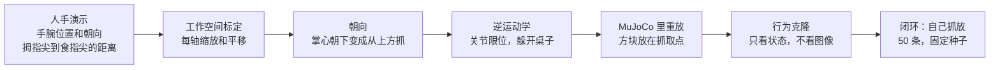

# 人手演示怎么在仿真里变成机械臂

这份说明给第一次看的人。目标只有一个：把「手腕在哪儿、手张得多大」变成仿真里一台机械臂的动作，先原样重放，再拿这些动作训练一个小策略，看它自己能不能把方块放到指定位置。

仓库里没有 16GB 的 EgoDex `test.zip`（许可也不允许提交）。所以下面的成功率用的是 **按 EgoDex 统一格式合成的 `basic_pick_place`**，不是真实录像。同一套重定向函数可以读真实的统一 episode；还没在下载好的 EgoDex / HOT3D 上测过，那个数是 **待补**。

## 一张图



## 选了什么

| 项目 | 选择 | 原因 |
|---|---|---|
| 任务 | 桌面抓放，对应 EgoDex 的 `basic_pick_place` | 只有抓起和放下，成功与否能用方块位置判断 |
| 机器人 | MuJoCo 里自带的 6 轴臂加平行夹爪 | 运动学类似 Franka（底座转动、肩、肘、三个腕关节）。不用官方 Panda 网格，也不用 robosuite / ManiSkill / LIBERO |
| 计算 | CPU、无头 | 这条链路不需要 GPU。`pip install mujoco` 之后本次整段评测 35.9 秒跑完 |
| 策略 | 两层小网络的行为克隆 | 没有装 torch。图像 ACT 仍然留在 Colab 笔记本里，不在这里训 |

夹爪靠指垫和摩擦把方块夹起来，没有吸盘，也没有「碰到就焊住」的简化。

## 重定向在做什么

人手坐标和机器人坐标不是同一套。合成演示里，手在一个更大、更高的盒子里动；机器人只能在桌子前方的一小块里动。标定按三个轴各自做：

`机器人坐标 = 缩放 × 人手坐标 + 平移`

缩放和偏移可以用两组对应点做最小二乘，也可以直接用两只盒子的边界。合成数据用的是后一种，三个轴的缩放大约是 0.333、0.533、0.457（写在结果 JSON 里）。

朝向：手腕旋转乘一个固定的工具旋转。人手「掌心朝下」（腕部旋转是单位阵）对应夹爪竖直向下。绕竖直轴转一下，接近方向仍然朝下。

开合：拇指尖（第 4 点）到食指尖（第 8 点）的距离。张开约 8 cm 以上夹爪全开，小于约 2.5 cm 夹紧，中间线性过渡。

逆运动学用阻尼最小二乘，关节角夹在限位里。连杆撞到桌子时，把目标抬高 2 cm 再解，最多 5 次。这次 20 条回放里没有发生抬升。

## 怎么算成功

方块中心离目标点的水平距离 **不超过 4 cm**，并且高度还在 0.20 m 到 0.30 m（停在桌面上，没有飞走或掉下去）。起点和目标至少隔开 12 cm，所以方块完全没动不会被算成成功。

评测种子：

| 用途 | 种子 |
|---|---|
| 40 条人类训练演示 | 0–39 |
| 40 条机器人训练演示 | 1000–1039 |
| 20 条留出回放 | 2000–2019 |
| 50 条闭环评测（四种方法共用） | 3000–3049 |

混合策略用人类的前 20 条加机器人的前 20 条，总数仍是 40，不是把两边拼成 80。

每种策略只训了 **一个** 网络种子（人类 10、机器人 11、混合 12）。下面的 50 条是换了桌面摆放之后的闭环，不是训练种子的平均。

## 这次测到的数

来源：`docs/retarget_sim_results.json`（由 `python scripts/sim/run_benchmark.py` 写出，`elapsed_s` = 35.9）。单位是这条合成任务上的结果。

回放（开环，把求好的关节角放进仿真）：

| 项目 | 结果 |
|---|---|
| 重定向后的人类轨迹，留出 20 条 | **20/20**，水平误差平均 0.0013 m |
| 这 20 条的 IK 位置误差 | 每条中位数再取中位数 **0.000938 m**；单帧最大不超过 0.00100 m |
| 标定之后，闭合点对照设计好的方块位置 | 误差是数值上的 0（合成路径来回映射，不是真实感知） |
| 用来训练的 40 条人类演示、40 条机器人演示，教师自己执行 | 都是 **40/40** |

闭环（同一 50 个种子，时限 5.9 秒）：

| 方法 | 成功 | 成功率 | 结束时水平误差平均 |
|---|---|---|---|
| 脚本专家（知道起点和目标，走规划好的路径） | 50/50 | 100% | 0.0013 m |
| 行为克隆，只用重定向后的人类演示 | 23/50 | 46% | 0.0888 m |
| 行为克隆，只用 40 条机器人演示 | 20/50 | 40% | 0.0922 m |
| 行为克隆，人类 20 条 + 机器人 20 条 | 34/50 | 68% | 0.0646 m |

成功的那些，方块几乎就在目标上（混合策略的误差中位数是 0.0026 m）。失败的那些通常是没夹起来，方块还在起点，所以平均误差会到好几厘米。

训练集上，路点编码（沿起点到目标的比例、侧向、高度）的均方误差是：人类 0.000620，机器人 0.000766，混合 0.000865。这只说明网络记住了演示里的路点，**不是**上面的成功率。

混合这一次比单独训练高，只代表种子 12 的这一次。没有再换训练种子重跑，不要把它写成「混合一定更好」。

## 自己跑

```bash
pip install mujoco numpy
python -m unittest tests.test_retarget_sim
python scripts/sim/run_benchmark.py --out docs/retarget_sim_results.json
```

`--quick` 只跑几条，用来看命令通不通，不能当成上表的成功率。

## 这些数不能当成什么

- 不是真实 EgoDex 或 HOT3D 录像的重放。手上没有感知噪声，路径是规则的抓放再加最多 3 cm 的侧向弧。
- 不是图像策略，也不是 ACT。输入是仿真里的末端、夹爪、方块和目标位置。
- 不是真机。夹爪、桌面摩擦和这台简化 6 轴臂都是为了在 CPU 上能夹住方块而调过的。
- 脚本专家是这条任务的上界。行为克隆明显更低，差在闭环时会走偏，不是差在重放。
