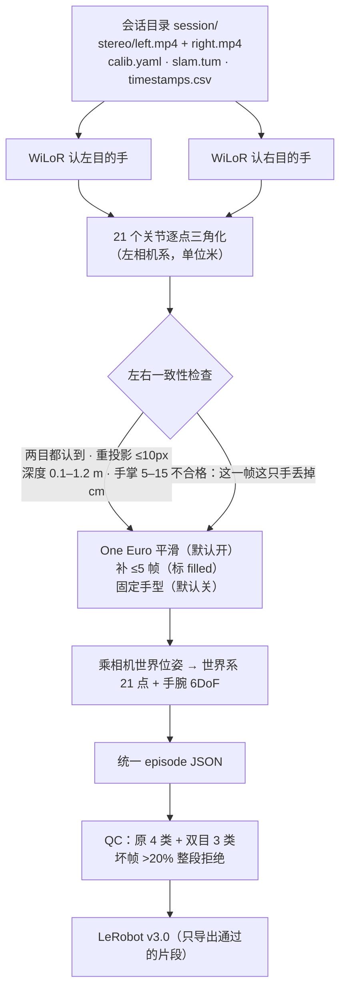

# 双目手部管线：一条命令从录像到 LeRobot

> 给新手：两个摄像头就像人的两只眼睛。同一只手在左右两张图里的位置有一点点差别（视差），靠这个差别就能算出手离眼睛多远，而且是真实的“米”。这条管线把这件事自动化，最后得到机器人能直接学习的数据。

## 1. 流程



## 2. 怎么跑

```bash
# 环境变量（WiLoR + MANO），与 scripts/headcam/hand_pose.py 相同
export MANO_MODEL_DIR=/path/mano WILOR_CHECKPOINT=.../wilor_final.ckpt \
       WILOR_CONFIG=.../model_config.yaml WILOR_DETECTOR=.../detector.pt PYTHONPATH=/path/WiLoR

# 自有设备（先校验再跑）
python scripts/validate_session.py /data/sess01
python scripts/run_stereo_pipeline.py --session /data/sess01 --out outputs/sess01

# HOT3D（自动先转成会话目录）
python scripts/run_stereo_pipeline.py --hot3d data/train_quest3/clip-000000 data/train_quest3/clip-000300 --out outputs/hot3d
```

WiLoR 环境的 numpy 太老、导入不了 pyarrow 时，加 `--export-python /path/to/python`（一个装了 pyarrow 的 Python）做 LeRobot 导出。WiLoR 结果缓存在 `out/cache/`，改检查或平滑参数后重跑只要几秒。

输出：`episodes/*.json`、`qc/yield.csv|html`、`lerobot/`、`report.json`、`report.md`。

| 开关 | 默认 | 说明 |
|---|---|---|
| `--smooth` | `one_euro` | `none` / `one_euro` / `kalman` |
| `--min-cutoff` / `--beta` | 3.0 Hz / 50 | One Euro 参数，见 §4 为什么不用 PR #19 的 1.0 / 0.5 |
| `--max-gap` | 5 | 最多补几帧；补的帧 `filled=true`，QC 不当成测到 |
| `--fixed-shape` | 关 | 固定手型（EgoDex 上没收益） |
| `--max-reproj-px` | 10 | 一只手 21 个关节重投影误差的中位数上限 |
| `--no-consistency` | — | 关掉一致性检查（对比用） |

一致性检查的阈值是**事先按常识定的**，没有用 HOT3D 真值调过：重投影中位数 ≤ 10 px；能三角化的关节（单关节重投影 ≤ 15 px）≥ 15 个；手腕深度 0.1–1.2 m；手腕到中指根 5–15 cm。

> 下面第 3 节的手腕误差是旧默认（One Euro，或后来的 2 cm/帧 + RTS q=0.3）跑出来的。当前默认是按时间的预测门限和速度自适应的 RTS（q 约 30–300）。用新默认重跑 **待补**。见 [hot3d_stereo/fast_motion.md](hot3d_stereo/fast_motion.md)。

## 3. HOT3D Quest3 实测（4 段 × 150 帧 = 600 帧，全部帧）

片段：clip-000000、000300、000700、001100（和 PR #21 同一批）。Quest3 两个 SLAM 黑白鱼眼相机去畸变成针孔（f≈505 px，1024×1280），基线 6.4 cm。真值是 HOT3D 的 MANO 手（动捕），换算成同样的 21 点。完整报告：[`stereo_pipeline/hot3d_quest3_report.md`](stereo_pipeline/hot3d_quest3_report.md)。

### 3.1 手腕世界坐标误差（中位数 / p90 / ≤2 cm 比例）

| 组 | 默认管线 |
|---|---|
| 检查前：两目都认到就三角化（989 只手·帧） | 1.27 cm / 4.83 cm / 71% |
| 同一批手用 WiLoR 单目（参照） | 2.59 cm / 6.19 cm / 35% |
| 检查后：通过一致性检查（941） | **1.24 cm / 3.97 cm / 73%** |
| 最终：平滑后、真正测到的帧（908） | 1.30 cm / 3.76 cm / 74% |
| 被拒：可三角化关节太少（22） | 3.67 / 37.61 / 36% |
| 被拒：手掌尺寸不合理（24） | 6.98 / 36.97 / 29% |
| 被拒：重投影误差大（2） | 20.08 / 34.85 / 50% |

读法：
- 一致性检查拒掉了 48 只手·帧（约 5%），被拒的那些误差明显更大（中位 3.7–20 cm），所以 p90 从 4.83 降到 3.97 cm，中位数几乎不变。最差的 10% 还在 4 cm 左右，**检查没有把它降到 2 cm**。
- 双目和单目比：中位数 1.27 vs 2.59 cm，2 cm 以内 71% vs 35%。
- 和 PR #21 的 1.22 cm 不完全可比：那次是每 3 帧取 1 帧、按“两目都可见”筛选的真值手，这次是全部帧、按“两目都认到”算，而且画面经过了 H.264 视频编码（crf 10）。

### 3.2 平滑（只在 clip-000000 上选参数，其余 3 段当留出集）

| One Euro 参数 | 留出 3 段：最终手腕 中位 / p90 / ≤2 cm |
|---|---|
| 不平滑 | 1.29 / 4.66 / 69% |
| PR #19 默认 min_cutoff=1、beta=0.5 | 2.07 / 6.33 / 48%（滞后严重） |
| **新默认 min_cutoff=3、beta=50** | 1.30 / 4.73 / 70% |

结论：PR #19 的参数在“世界系米制轨迹”上滞后太多（手每秒移动零点几米，beta=0.5 几乎不提截止频率），会把误差翻倍，所以这里不用它。新参数对精度基本中性，但能减抖：手腕二阶差分中位数（毫米/帧²）每段每只手都下降，例如 clip-000700 右手 14.2 → 6.8，clip-000000 左手 8.0 → 5.3（`hot3d_quest3_report.json` 里的 `jitter`）。

### 3.3 QC 与产出率

产出率 **25%**（150 / 600 帧），4 段只有 clip-000000 通过（坏帧 15.3%）；其余三段坏帧 54.7%、21.3%、37.3%，超过 20% 门限被整段拒绝。关掉一致性检查时产出率 50%（2 段通过），代价是最终手腕 p90 从 3.76 cm 变成 4.67 cm（中位 1.30 → 1.32 cm）。

坏帧原因（帧数；一帧可有多个原因 / 只因这一条）：

| 原因 | 帧数 | 只因这一条 |
|---|---|---|
| 只有一目认到手 | 113 | 58 |
| 补出来的帧 | 50 | 23 |
| 左右目对不上 | 48 | 24 |
| 手出画 | 57 | 0 |
| 摆拍或静止 | 31 | 2 |
| 运动模糊 | 13 | 8 |
| 视线飘移 | 0 | 0 |

产出率低的主要原因是“只有一目认到手”：Quest3 两个 SLAM 相机朝向不同、针孔裁剪后约 91° 视场，手在边缘时只进一只镜头。这正是选型里要 100° 左右镜头的理由。另外“坏帧”的口径是严格的：任何一只被认到的手不合格，这一帧就算坏。

### 3.4 耗时（首次完整运行，CPU 8 核，无 GPU）

| 阶段 | 秒 |
|---|---|
| HOT3D → 会话目录（去畸变 + 写视频 + MANO 真值） | 356.0 |
| WiLoR 推理（1200 张图，约 1.36 秒/张） | 1634.5 |
| 三角化 + 一致性 + 平滑 + 世界系 | 2.5 |
| QC | 0.03 |
| LeRobot 导出 | 1.3 |
| 合计 | 1994.9 |

在 GPU 上 WiLoR 会快很多，但这台机器没有 GPU，这里没测。

## 4. 已知限制

- 一致性检查只能拒“明显认错”的手，最差 10% 仍在约 4 cm。
- QC 阈值（20% 坏帧、严格口径）是沿用 EgoDex 的，双目数据上偏严，等自采数据再定。
- HOT3D 没有 IMU、没有彩色图；左右曝光时间完全一致，真实同步误差要等设备测。
